# Clothing Store App - Development Guide

> **📖 Document Structure:**
> - **Part I: AI Agent Instructions** - Mandatory rules and workflows for autonomous agents
> - **Part II: Developer Reference** - Technical documentation, patterns, and best practices

---

# 🤖 PART I: AI AGENT INSTRUCTIONS

> **For AI Agents**: Read this entire part before making any changes. These are MANDATORY requirements.
> **For Human Developers**: Skip to Part II for technical reference.

## Quick Start for AI Agents

Read in this order:
1. **Agent Mode Rules** (Section 1) - Non-negotiable constraints
2. **Quick Reference Card** (Section 2) - Critical project facts
3. **Agent Workflow** (Section 3) - Step-by-step process
4. **Quality Gates** (Section 4) - Verification requirements

Then reference Part II for technical details as needed.

---

## 1. Agent Mode Rules (MANDATORY)

**These rules are NON-NEGOTIABLE when operating in autonomous agent mode.**

### 1.1. NEVER Assume - Always Verify
- ❌ **NEVER** guess at file contents, API signatures, or implementation details
- ✅ **ALWAYS** use `read_file`, `semantic_search`, or `grep_search` before making changes
- ✅ **ALWAYS** check if a file/component/function exists before referencing it
- ✅ **ALWAYS** read the full function/component before modifying it

### 1.2. Test Before Declaring Success
- ❌ **NEVER** say "done" or "complete" without verification
- ✅ **ALWAYS** run `get_errors` after file modifications
- ✅ **ALWAYS** check both `/en` and `/ar` routes for i18n changes
- ✅ **ALWAYS** test in light AND dark mode for UI changes
- ✅ **ALWAYS** verify mobile responsiveness for layout changes

### 1.3. Maintain Consistency - Follow Existing Patterns
- ❌ **NEVER** introduce new patterns when existing ones work
- ❌ **NEVER** mix styling approaches (e.g., inline styles + Tailwind)
- ✅ **ALWAYS** use existing components from `components/ui/` before creating new ones
- ✅ **ALWAYS** follow the translation namespace structure
- ✅ **ALWAYS** use the same state management approach (React Context, not Redux)

### 1.4. Document As You Go
- ❌ **NEVER** make architectural changes without updating docs
- ✅ **ALWAYS** update `docs/features/` when completing features
- ✅ **ALWAYS** update this file when introducing new patterns
- ✅ **ALWAYS** add JSDoc comments for complex functions

### 1.5. Safe File Operations
- ❌ **NEVER** delete files without explicit user confirmation
- ❌ **NEVER** overwrite files without reading them first
- ✅ **ALWAYS** create backups for risky operations (suggest git commit first)
- ✅ **ALWAYS** use `replace_string_in_file` with sufficient context (3-5 lines)

### 1.6. Security First
- ❌ **NEVER** commit API keys, tokens, or secrets
- ❌ **NEVER** disable security features without explicit approval
- ✅ **ALWAYS** validate user inputs
- ✅ **ALWAYS** use parameterized queries
- ✅ **ALWAYS** follow principle of least privilege

### 1.7. Error Handling is Mandatory
- ❌ **NEVER** leave try-catch blocks empty
- ❌ **NEVER** suppress errors without logging
- ✅ **ALWAYS** provide meaningful error messages
- ✅ **ALWAYS** handle edge cases (null, undefined, empty arrays)

### 1.8. Respect Project Constraints
- ❌ **NEVER** use `npm` in frontend (use `pnpm` only)
- ❌ **NEVER** use `pnpm` in backend (use `npm` only)
- ❌ **NEVER** bypass the i18n system with hardcoded strings
- ❌ **NEVER** ignore the RTL requirement for Arabic
- ✅ **ALWAYS** add translations to BOTH `en.json` and `ar.json`

---

## 2. Quick Reference Card

**3-Service Microservices Architecture:**
- `frontend/` (Next.js + TypeScript + pnpm) → Port 3000
- `backend-web/` (Node.js + Express + npm) → Port 5000  
- `cloth-store-app-tryon/` (FastAPI + Python) → Port 8000 → **Proxies to Google Colab** ⚠️

**Critical Workflows:**
```bash
# Run full stack
docker-compose up --build

# Individual services
cd frontend && pnpm dev              # ⚠️ Use pnpm, not npm
cd backend-web && npm run dev        # ⚠️ Use npm, not pnpm
cd cloth-store-app-tryon && uvicorn app.main:app --reload
```

**Before Any Changes:**
1. Run `get_errors` to check TypeScript/lint issues
2. Test in both `/en` and `/ar` locales
3. Verify dark mode still works
4. Check mobile responsiveness

**State Management:** React Context API (no Redux) - see `lib/auth-context.tsx`, `lib/cart-context.tsx`  
**UI Components:** shadcn/ui (61 components in `components/ui/`) - use these, don't create custom  
**i18n:** `useTranslations('namespace')` - add keys to both `messages/en.json` and `messages/ar.json`  
**Auth:** Mock authentication in dev (see credentials in section 3)

### 🔑 Most Critical Non-Obvious Patterns

1. **Virtual Try-On is NOT Local**: The `cloth-store-app-tryon` service is a **proxy only**. It forwards requests to Google Colab via ngrok. Without setting `COLAB_API_URL` in `.env`, the entire feature fails silently. See Section 2 for setup.

2. **Package Managers are Strict**: Frontend uses `pnpm` ONLY. Backend uses `npm` ONLY. Mixing them breaks lock files and dependencies.

3. **All Data is Mock**: The frontend uses `lib/mock-data.ts` for all data. Backend API routes exist but are commented out in `backend-web/index.js`. No real database connections yet.

4. **i18n is Mandatory**: Every user-facing string MUST have entries in both `messages/en.json` AND `messages/ar.json`. Routes are prefixed with locale: `/en/shop` and `/ar/shop`. Use `useTranslations('namespace')` - never hardcode strings.

5. **Auth is Simulated**: `lib/auth-context.tsx` simulates authentication with a 1-second delay. Test credentials: `admin@prova.com/admin123`, `store@prova.com/store123`, `cs@prova.com/cs123`. No backend API calls.

6. **shadcn/ui is the Standard**: All UI components should use the 61 pre-built components in `components/ui/`. Creating custom components instead of using existing ones violates project conventions.

7. **Dark Mode Uses CSS Variables**: Theme switching is instant (100ms) using CSS custom properties in `globals.css`. Always use semantic color variables like `bg-background`, `text-foreground` - never hardcode colors.

8. **RTL is Automatic**: Arabic routes automatically apply RTL layout. Only add `no-flip` class to elements that shouldn't reverse (brand names, prices, numbers).

---

## 3. Agent Workflow

**Follow this systematic process for every task:**

```
1. 📋 READ & UNDERSTAND
   → Use semantic_search, grep_search, read_file
   → Verify current implementation
   → Check for existing patterns

2. 🎯 PLAN & PRESENT
   → Create detailed plan with file list
   → Present options with trade-offs
   → Get user confirmation

3. 🔨 IMPLEMENT INCREMENTALLY
   → Make small, testable changes
   → Use manage_todo_list for tracking
   → Commit at logical milestones

4. ✅ VERIFY & VALIDATE
   → Run get_errors after each change
   → Test in multiple scenarios
   → Check accessibility and i18n

5. 📝 DOCUMENT & REPORT
   → Update feature docs
   → Update this file if patterns changed
   → Provide comprehensive summary
```

### Failure Recovery Protocol

**If something breaks:**
1. ✅ Immediately stop and assess the damage
2. ✅ Use `get_errors` to identify the issue
3. ✅ Read the affected files completely
4. ✅ Explain what went wrong and why
5. ✅ Present fix options before proceeding
6. ✅ Suggest git revert if fix is complex

**If requirements are unclear:**
1. ✅ List what you understand
2. ✅ List what's ambiguous
3. ✅ Ask specific questions
4. ✅ Suggest alternatives
5. ✅ Wait for clarification (don't guess)

---

## 4. Quality Gates & Enforcement

### 4.1. Mandatory Pre-Commit Checks

**Before ANY code changes, agents MUST verify:**
- ✅ **Zero TypeScript errors** - Run `get_errors`
- ✅ **Both locales tested** - Test `/en` and `/ar` routes (if i18n affected)
- ✅ **Dark mode works** - Toggle theme (if UI affected)
- ✅ **Mobile responsive** - Test mobile viewport (if layout affected)
- ✅ **Error handling** - All try-catch blocks handle errors properly
- ✅ **Translations added** - Both `en.json` and `ar.json` updated
- ✅ **No secrets** - No API keys or tokens committed
- ✅ **Inputs validated** - User inputs sanitized

### 4.2. Success Criteria

**A task is NOT complete until:**
- ✅ **Functional**: Feature works as requested in all scenarios
- ✅ **Tested**: Verified in en/ar, light/dark, desktop/mobile
- ✅ **Clean**: Zero TypeScript errors, no console.logs
- ✅ **Accessible**: ARIA labels, keyboard navigation works
- ✅ **Documented**: Feature docs updated, code commented
- ✅ **Secure**: No vulnerabilities, inputs validated
- ✅ **Consistent**: Follows existing patterns and conventions
- ✅ **Verified**: All quality gates passed
- ✅ **Summarized**: Comprehensive report with metrics provided

### 4.3. Prohibited Actions

| ❌ NEVER Do This | Why | Alternative |
|------------------|-----|-------------|
| Assume file contents | Leads to incorrect changes | Use `read_file` first |
| Skip error checking | Breaks the build | Always run `get_errors` |
| Hardcode strings | Breaks i18n | Use translation keys |
| Use `any` type | Loses type safety | Define proper interfaces |
| Empty catch blocks | Hides errors | Log and handle gracefully |
| Delete without asking | Data loss risk | Ask user first |
| Mix package managers | Breaks dependencies | Frontend=pnpm, Backend=npm |
| Ignore RTL | Breaks Arabic UI | Test `/ar` route |
| Commit secrets | Security breach | Use environment variables |
| Create custom components | Code duplication | Use shadcn/ui first |

### 4.4. Escalation Protocol

**When to stop and ask for help:**
1. 🚨 TypeScript errors you can't resolve after 2 attempts
2. 🚨 Breaking changes that affect multiple features
3. 🚨 Security concerns or potential vulnerabilities
4. 🚨 Unclear requirements that could lead to wrong implementation

**Escalation format:**
```
🚨 ESCALATION NEEDED
Issue: [Brief description]
Attempted: [What you tried]
Options: [Possible approaches]
Recommendation: [Your suggested path]
```

---

## 5. Professional Workflow Principles

When working on any task in this project, follow this systematic approach:

### Phase 1: Analysis & Planning
1. **Understand the Request**: Clarify the user's goal and identify all affected areas
2. **Analyze Scope**: Use semantic search and grep to understand the current state
3. **Identify Dependencies**: Find related files, components, and patterns already in use
4. **Create Design Plan**: Present a clear, structured plan with:
   - All files that need changes
   - Estimated complexity and time
   - Multiple approach options when applicable
   - Potential conflicts or issues

### Phase 2: Verification & Alignment
1. **Present Options**: Offer choices (e.g., Option A: comprehensive, Option B: minimal, Option C: custom)
2. **Get User Confirmation**: Wait for user to select approach before proceeding
3. **Set Expectations**: Be clear about what will be done and what won't

### Phase 3: Systematic Implementation
1. **Break Down Work**: Divide large tasks into logical, trackable phases
2. **Incremental Progress**: Complete one section at a time, test, then move forward
3. **Use Todo Lists**: Maintain visible progress tracking with `manage_todo_list`
4. **Smart Commits**: Follow strategic commit timing (see commit strategy below)
5. **Quality Checks**: Run error checks and validation after each change

### Commit Strategy

**Goal**: Balance progress visibility with avoiding excessive commits

**When to Commit:**

1. **After Completing a Logical Unit**:
   - Completed a full feature module (not individual functions)
   - Finished a complete page or component with all its translations
   - Completed configuration setup that makes a feature functional
   
2. **At Natural Breakpoints**:
   - For work with **many phases** (5+ phases): Commit after each phase completion
   - For work with **12+ small parts**: Commit at 50% completion, then at 100%
   - For work with **3-4 medium phases**: Commit at 50% and 100%
   
3. **After Significant Milestones**:
   - All tests passing after major changes
   - Feature fully functional and tested
   - Documentation consolidated and updated
   - Breaking points where code is stable and revertable

**When NOT to Commit:**
- After every small file edit (unless it's the only change for that task)
- In the middle of a multi-file refactor before testing
- After adding individual translation keys (wait for batch completion)
- During exploratory changes that might be reverted

**Examples:**
- ✅ **Good**: "feat: Complete virtual-tryon page translation (34 keys, 12 sections)"
- ✅ **Good**: "feat: Add admin dashboard with 5 sub-pages (Part 1/2)"
- ❌ **Too Early**: "feat: Add title translation to virtual-tryon page"
- ❌ **Too Late**: "feat: Complete entire i18n implementation" (if work took 20+ hours)

### Phase 4: Quality Assurance
1. **Test for Errors**: Use `get_errors` to verify no compilation/lint issues
2. **Cross-Reference**: Ensure consistency with existing patterns and conventions
3. **Document Changes**: Update relevant docs if architecture or patterns change
4. **Final Verification**: Check that all original requirements are met

### Phase 5: Completion & Documentation
1. **Comprehensive Report**: Summarize what was done, files changed, metrics
2. **Handoff Information**: Provide clear next steps or testing instructions
3. **Update Project Context**: Note any new patterns or conventions established

### Key Principles
- **Don't Assume**: Always gather context first, never guess at implementations
- **Think Systematically**: Large changes need planning, small changes need context
- **Be Transparent**: Show your reasoning, present trade-offs, explain decisions
- **Track Progress**: Make work visible through todos, commits, and status updates
- **Maintain Quality**: Follow existing patterns, add improvements where logical
- **Verify Everything**: Check for errors, conflicts, and regressions after changes
- **Update Instructions**: When completing major features or changing project structure, update this copilot-instructions.md file to reflect new patterns, conventions, or architectural decisions

---

## 6. Feature Documentation Management

### When a Feature is Complete

After completing any significant feature or major functionality:

1. **Create Feature Summary Document**
   - Location: `docs/features/[feature-name].md`
   - Structure:
     ```markdown
     # Feature: [Feature Name]
     
     ## Overview
     Brief description of what the feature does
     
     ## Implementation Details
     - Files modified/created
     - Key components and their responsibilities
     - Integration points with other features
     
     ## Configuration
     - Environment variables
     - Configuration files
     - Setup requirements
     
     ## Usage
     - How to use the feature
     - API endpoints (if applicable)
     - UI components (if applicable)
     
     ## Technical Decisions
     - Architecture choices
     - Libraries/frameworks used
     - Trade-offs made
     
     ## Testing
     - How to test
     - Test coverage
     
     ## Future Enhancements
     - Planned improvements
     - Known limitations
     ```

2. **Consolidate Documentation**
   - Move all scattered notes, TODOs, and temporary docs into the feature summary
   - **DELETE all temporary/phase documentation files** (plans, progress reports, completion reports)
   - Keep only: `api-contract.md`, `architecture.md`, `roadmap.md`, and `features/` directory
   - Update this copilot-instructions.md if the feature introduces new patterns

3. **Update Feature Registry**
   - Add entry to `docs/features/README.md` with:
     - Feature name
     - Completion date
     - Key files affected
     - Related features

4. **Update copilot-instructions.md**
   - Add new patterns or conventions to Section 3 (Code Conventions)
   - Update project structure if routes/components added
   - Document architectural changes in relevant sections

### When Editing Existing Features

- **Always check** `docs/features/` for existing feature documentation
- **Update the feature summary** when making changes, don't create new docs
- **Keep the summary as single source of truth** for that feature
- If the feature pattern changes significantly, update this copilot-instructions.md

### Documentation Hygiene

- **Delete temporary docs** after consolidation
- **Avoid duplicate documentation** across multiple files
- **Use feature summaries** as the primary reference for completed work
- **Link to feature docs** from code comments when explaining complex logic

---

## 7. Common Agent Tasks & Procedures

This section provides step-by-step procedures for common agent tasks.

### Adding a New Page

1. **Create page file:** `frontend/app/[locale]/my-page/page.tsx`
2. **Add translations:** Add keys to `messages/en.json` and `messages/ar.json`
3. **Import translations:** `const t = useTranslations('myPage')`
4. **Add navigation link:** Update navbar or sidebar
5. **Test both locales:** Visit `/en/my-page` and `/ar/my-page`

### Adding a New Component

1. **Check shadcn/ui first:** See if component exists in `components/ui/`
2. **Create component:** `components/feature/my-component.tsx`
3. **Use TypeScript:** Define props interface
4. **Add i18n:** Use `useTranslations` if displaying text
5. **Follow styling:** Use Tailwind + semantic color variables

### Adding a New Translation Namespace

1. **Define structure in en.json:**
```json
{
  "myFeature": {
    "title": "My Feature",
    "description": "Feature description",
    "actions": {
      "save": "Save",
      "cancel": "Cancel"
    }
  }
}
```

2. **Mirror in ar.json:**
```json
{
  "myFeature": {
    "title": "ميزتي",
    "description": "وصف الميزة",
    "actions": {
      "save": "حفظ",
      "cancel": "إلغاء"
    }
  }
}
```

3. **Use in component:**
```tsx
const t = useTranslations('myFeature')
<h1>{t('title')}</h1>
<p>{t('description')}</p>
<button>{t('actions.save')}</button>
```

### Implementing Backend API Endpoint

**When backend routes are implemented:**

1. **Create route file:** `backend-web/routes/myroute.js`
```javascript
const express = require('express');
const router = express.Router();

router.get('/', async (req, res) => {
  // Handle GET request
});

module.exports = router;
```

2. **Create controller:** `backend-web/controllers/myController.js`
3. **Uncomment in index.js:** `app.use('/api/myroute', require('./routes/myroute'))`
4. **Update Swagger docs:** Add JSDoc comments for API documentation
5. **Update frontend:** Replace mock data with API calls

### Working with Virtual Try-On

**Prerequisites:**
1. Colab notebook running (see Section 2)
2. ngrok URL in `cloth-store-app-tryon/.env`
3. AI service running on port 8000

**Testing Flow:**
```bash
# 1. Start AI service
cd cloth-store-app-tryon
python main.py

# 2. Test health endpoint
curl http://localhost:8000/api/health/colab

# 3. Test try-on (from frontend or backend)
POST http://localhost:8000/api/tryon/process
  - person_image: file
  - garment_image: file
```

---

## 8. Pre-Commit & Pre-Push Quality Checklist

### Before Every Commit

**MANDATORY checks before every commit:**

1. ✅ Run `get_errors` to check for TypeScript/lint errors
2. ✅ Test in both English and Arabic (if UI changes)
3. ✅ Verify dark mode still works (if styling changes)
4. ✅ Check mobile responsiveness (if layout changes)
5. ✅ Update relevant feature documentation
6. ✅ Add/update translations if needed

### Before Every Push

**Pre-Push Quality Gate:**

The `get_errors` tool checks:
- TypeScript compilation errors
- ESLint warnings/errors  
- Build-time errors

**Manual verification commands:**
```bash
# Frontend
cd frontend
pnpm tsc --noEmit      # TypeScript errors
pnpm lint              # ESLint errors
pnpm build             # Build errors

# Backend
cd backend-web
npm run lint           # If configured
node --check index.js  # Syntax check
```

**Automated Pre-Push Hook (if using Husky):**
```bash
#!/usr/bin/env sh
. "$(dirname -- "$0")/_/husky.sh"

echo "🚦 Running quality gates before push..."

# Frontend checks
cd frontend
echo "📦 Frontend: Type checking..."
pnpm tsc --noEmit || exit 1

echo "📦 Frontend: Linting..."
pnpm lint || exit 1

echo "📦 Frontend: Testing..."
pnpm test --passWithNoTests || exit 1

# Backend checks
cd ../backend-web
echo "🔧 Backend: Testing..."
npm test --passWithNoTests || exit 1

echo "✅ All quality gates passed!"
```

---

## 9. Complete Feature Implementation Example

This section demonstrates the complete agent workflow for implementing a new feature, from planning to deployment.

### Feature: Size Recommendation System

**Goal:** Add AI-powered size recommendations to product pages based on user measurements.

#### Phase 1: Planning & Analysis (15-30 minutes)

**1. Requirements Gathering:**
```
User Story:
As a customer, I want size recommendations based on my measurements
so that I can order clothes that fit better.

Acceptance Criteria:
- User can input body measurements (chest, waist, hips, height)
- System suggests best size for each product
- Measurements saved to user profile
- Works in both English and Arabic
- Supports metric and imperial units
```

**2. Technical Analysis:**
```bash
# Search for existing measurement handling
semantic_search query="body measurements sizing"

# Check for related components
grep_search query="measurement|sizing|size.*chart" isRegexp=true

# Review existing models
read_file filePath="backend-web/models/BodyMeasurements.js"
```

**3. Architecture Design:**
```
Files to create/modify:
Frontend:
  - app/[locale]/profile/measurements/page.tsx (NEW)
  - components/product/size-recommendation.tsx (NEW)
  - lib/measurements-context.tsx (NEW)
  - messages/en.json (UPDATE - add 'measurements' namespace)
  - messages/ar.json (UPDATE - add 'measurements' namespace)

Backend:
  - routes/measurements.js (NEW)
  - controllers/measurementsController.js (NEW)
  - models/BodyMeasurements.js (EXISTS - review and update)

AI Service:
  - app/routers/sizing.py (NEW)
  - app/services/size_predictor.py (NEW)
```

**4. Create Implementation Plan:**
```markdown
## Implementation Plan

### Phase 1: Data Layer (Backend)
1. Review/update BodyMeasurements model
2. Create measurements API endpoints
3. Add validation middleware

### Phase 2: Context & State (Frontend)
1. Create measurements context
2. Add localStorage persistence
3. Create measurement input form

### Phase 3: UI Components
1. Build measurement input page
2. Create size recommendation card
3. Add to product detail page

### Phase 4: AI Integration
1. Create sizing endpoint in AI service
2. Implement size prediction algorithm
3. Connect frontend to AI service

### Phase 5: i18n & Testing
1. Add translations (en + ar)
2. Write unit tests
3. Write integration tests
4. E2E test complete flow

### Phase 6: Documentation
1. Update API contract
2. Create feature documentation
3. Update copilot instructions
```

#### Phase 2: Implementation (2-3 hours)

**Step 1: Update Data Model**
```javascript
// backend-web/models/BodyMeasurements.js (update)
const mongoose = require('mongoose');

const bodyMeasurementsSchema = new mongoose.Schema({
  userId: { type: mongoose.Schema.Types.ObjectId, ref: 'User', required: true },
  unit: { type: String, enum: ['metric', 'imperial'], default: 'metric' },
  chest: { type: Number, required: true },
  waist: { type: Number, required: true },
  hips: { type: Number, required: true },
  height: { type: Number, required: true },
  weight: { type: Number },
  shoeSize: { type: Number }
}, { timestamps: true });

module.exports = mongoose.model('BodyMeasurements', bodyMeasurementsSchema);
```

**Step 2: Create API Endpoints**
```javascript
// backend-web/routes/measurements.js (new)
const express = require('express');
const router = express.Router();
const measurementsController = require('../controllers/measurementsController');
const { authMiddleware } = require('../middleware/auth');

router.post('/', authMiddleware, measurementsController.create);
router.get('/', authMiddleware, measurementsController.getUserMeasurements);
router.put('/:id', authMiddleware, measurementsController.update);

module.exports = router;
```

**Step 3: Create Context**
```tsx
// frontend/lib/measurements-context.tsx (new)
'use client'

import { createContext, useContext, useState, useEffect } from 'react'

interface Measurements {
  unit: 'metric' | 'imperial'
  chest: number
  waist: number
  hips: number
  height: number
}

interface MeasurementsContextType {
  measurements: Measurements | null
  saveMeasurements: (m: Measurements) => void
  clearMeasurements: () => void
}

const MeasurementsContext = createContext<MeasurementsContextType | undefined>(undefined)

export function MeasurementsProvider({ children }: { children: React.ReactNode }) {
  const [measurements, setMeasurements] = useState<Measurements | null>(null)

  useEffect(() => {
    const saved = localStorage.getItem('measurements')
    if (saved) setMeasurements(JSON.parse(saved))
  }, [])

  const saveMeasurements = (m: Measurements) => {
    setMeasurements(m)
    localStorage.setItem('measurements', JSON.stringify(m))
  }

  const clearMeasurements = () => {
    setMeasurements(null)
    localStorage.removeItem('measurements')
  }

  return (
    <MeasurementsContext.Provider value={{ measurements, saveMeasurements, clearMeasurements }}>
      {children}
    </MeasurementsContext.Provider>
  )
}

export const useMeasurements = () => {
  const context = useContext(MeasurementsContext)
  if (!context) throw new Error('useMeasurements must be used within MeasurementsProvider')
  return context
}
```

**Step 4: Create UI Component**
```tsx
// components/product/size-recommendation.tsx (new)
'use client'

import { useTranslations } from 'next-intl'
import { useMeasurements } from '@/lib/measurements-context'
import { Card, CardHeader, CardTitle, CardContent } from '@/components/ui/card'
import { Badge } from '@/components/ui/badge'
import { Button } from '@/components/ui/button'
import Link from 'next/link'

interface SizeRecommendationProps {
  productId: string
  availableSizes: string[]
}

export function SizeRecommendation({ productId, availableSizes }: SizeRecommendationProps) {
  const t = useTranslations('measurements')
  const { measurements } = useMeasurements()

  if (!measurements) {
    return (
      <Card>
        <CardHeader>
          <CardTitle>{t('needMeasurements')}</CardTitle>
        </CardHeader>
        <CardContent>
          <p className="text-sm text-muted-foreground mb-4">
            {t('measurementsDescription')}
          </p>
          <Button asChild>
            <Link href="/profile/measurements">{t('addMeasurements')}</Link>
          </Button>
        </CardContent>
      </Card>
    )
  }

  const recommendedSize = calculateRecommendedSize(measurements, productId, availableSizes)

  return (
    <Card className="border-primary">
      <CardHeader>
        <CardTitle>{t('recommendedSize')}</CardTitle>
      </CardHeader>
      <CardContent>
        <div className="flex items-center gap-2 mb-2">
          <Badge variant="default" className="text-xl px-4 py-2">
            {recommendedSize}
          </Badge>
          <span className="text-sm text-muted-foreground">
            {t('basedOnYourMeasurements')}
          </span>
        </div>
        <Button variant="link" asChild className="px-0">
          <Link href="/profile/measurements">{t('updateMeasurements')}</Link>
        </Button>
      </CardContent>
    </Card>
  )
}

function calculateRecommendedSize(
  measurements: any,
  productId: string,
  availableSizes: string[]
): string {
  // Simplified logic - in production, call AI service
  const { chest, waist, hips } = measurements
  const avgMeasurement = (chest + waist + hips) / 3

  if (avgMeasurement < 85) return 'S'
  if (avgMeasurement < 95) return 'M'
  if (avgMeasurement < 105) return 'L'
  return 'XL'
}
```

**Step 5: Add Translations**
```json
// messages/en.json (add)
{
  "measurements": {
    "title": "Body Measurements",
    "needMeasurements": "Get Personalized Size Recommendations",
    "measurementsDescription": "Add your body measurements to receive accurate size recommendations for every product.",
    "addMeasurements": "Add Measurements",
    "recommendedSize": "Recommended Size",
    "basedOnYourMeasurements": "Based on your measurements",
    "updateMeasurements": "Update measurements",
    "chest": "Chest",
    "waist": "Waist",
    "hips": "Hips",
    "height": "Height",
    "unit": "Unit",
    "metric": "Metric (cm)",
    "imperial": "Imperial (in)",
    "save": "Save Measurements"
  }
}

// messages/ar.json (mirror in Arabic)
{
  "measurements": {
    "title": "قياسات الجسم",
    "needMeasurements": "احصل على توصيات المقاس الشخصية",
    // ... rest of translations
  }
}
```

#### Phase 3: Testing (30-45 minutes)

**Unit Tests:**
```tsx
// __tests__/components/size-recommendation.test.tsx
import { render, screen } from '@testing-library/react'
import { SizeRecommendation } from '@/components/product/size-recommendation'
import { MeasurementsProvider } from '@/lib/measurements-context'

describe('SizeRecommendation', () => {
  it('shows add measurements prompt when no measurements', () => {
    render(
      <MeasurementsProvider>
        <SizeRecommendation productId="1" availableSizes={['S', 'M', 'L']} />
      </MeasurementsProvider>
    )
    expect(screen.getByText(/add measurements/i)).toBeInTheDocument()
  })

  it('displays recommended size when measurements exist', () => {
    localStorage.setItem('measurements', JSON.stringify({
      unit: 'metric',
      chest: 90,
      waist: 85,
      hips: 95,
      height: 175
    }))

    render(
      <MeasurementsProvider>
        <SizeRecommendation productId="1" availableSizes={['S', 'M', 'L']} />
      </MeasurementsProvider>
    )

    expect(screen.getByText('M')).toBeInTheDocument()
  })
})
```

**Integration Test:**
```typescript
// __tests__/e2e/measurements.e2e.test.ts
import { test, expect } from '@playwright/test'

test.describe('Measurements Flow', () => {
  test('user can add measurements and see recommendations', async ({ page }) => {
    await page.goto('/en/login')
    await page.fill('[name="email"]', 'test@example.com')
    await page.fill('[name="password"]', 'password123')
    await page.click('[type="submit"]')

    // Go to measurements page
    await page.goto('/en/profile/measurements')
    
    // Fill measurements
    await page.fill('[name="chest"]', '90')
    await page.fill('[name="waist"]', '85')
    await page.fill('[name="hips"]', '95')
    await page.fill('[name="height"]', '175')
    await page.click('button[type="submit"]')

    // Navigate to product
    await page.goto('/en/product/1')
    
    // Verify recommendation appears
    await expect(page.locator('[data-testid="size-recommendation"]')).toBeVisible()
    await expect(page.locator('[data-testid="recommended-size"]')).toContainText('M')
  })
})
```

#### Phase 4: Documentation (15-20 minutes)

**Create Feature Documentation:**
```markdown
// docs/features/size-recommendations.md
# Feature: Size Recommendation System

## Overview
AI-powered size recommendations based on user body measurements, helping customers choose the right size for better fit and reduced returns.

## Implementation Details

### Files Created
- `frontend/app/[locale]/profile/measurements/page.tsx` - Measurements input page
- `frontend/components/product/size-recommendation.tsx` - Recommendation display component
- `frontend/lib/measurements-context.tsx` - Global measurements state
- `backend-web/routes/measurements.js` - API routes
- `backend-web/controllers/measurementsController.js` - Business logic
- `cloth-store-app-tryon/app/routers/sizing.py` - AI sizing service

### Files Modified
- `frontend/messages/en.json` - Added 'measurements' namespace
- `frontend/messages/ar.json` - Added 'measurements' namespace
- `backend-web/index.js` - Registered measurements routes
- `backend-web/models/BodyMeasurements.js` - Updated schema

### Integration Points
- Auth Context - Requires authenticated user
- Cart Context - Size recommendations influence cart additions
- AI Service - Size prediction algorithm

## Configuration
No additional environment variables required. Uses existing auth and API configurations.

## Usage

### For Users
1. Navigate to Profile → Measurements
2. Input body measurements (chest, waist, hips, height)
3. Save measurements
4. Visit any product page to see recommended size

### For Developers
```tsx
import { useMeasurements } from '@/lib/measurements-context'
import { SizeRecommendation } from '@/components/product/size-recommendation'

function ProductPage({ product }) {
  return (
    <>
      <ProductDetails product={product} />
      <SizeRecommendation 
        productId={product.id} 
        availableSizes={product.sizes} 
      />
    </>
  )
}
```

## Technical Decisions

### Why Context API vs API Calls?
- Measurements don't change frequently
- Reduces API calls on every product page
- Faster user experience with localStorage cache
- Still syncs with backend for persistence

### Why Simple Algorithm vs Complex ML?
- Phase 1 uses rule-based logic for MVP
- Collects user feedback and data
- Phase 2 will train ML model on real data
- Balances complexity with time-to-market

### Unit System Support
- Supports both metric (cm) and imperial (inches)
- Conversion happens in frontend before storage
- Backend stores in metric for consistency

## Testing
- ✅ Unit tests: 95% coverage
- ✅ Integration tests: API and frontend flows
- ✅ E2E tests: Complete user journey
- ✅ i18n tested: Both en and ar locales
- ✅ Dark mode: Verified in both themes

## Future Enhancements
1. ML model training on user feedback data
2. Size history tracking (what sizes user actually ordered)
3. Brand-specific size adjustments
4. Virtual try-on integration
5. Size comparison across brands
6. Community-sourced fit feedback

## Known Limitations
- Algorithm is currently rule-based (not ML)
- Doesn't account for personal fit preferences (tight vs loose)
- No body type considerations yet
- Requires manual measurement input (no photo analysis)

## Related Features
- Virtual Try-On (`docs/features/virtual-tryon.md`)
- User Profile (`frontend/app/[locale]/profile/`)
- Product Detail Page (`frontend/app/[locale]/product/[id]/`)
```

**Update API Contract:**
```markdown
// docs/api-contract.md (add section)

### Measurements API

#### Create/Update Measurements
```http
POST /api/measurements
Authorization: Bearer {token}
Content-Type: application/json

{
  "unit": "metric",
  "chest": 90,
  "waist": 85,
  "hips": 95,
  "height": 175,
  "weight": 70
}

Response 201:
{
  "id": "abc123",
  "userId": "user456",
  "unit": "metric",
  "chest": 90,
  "waist": 85,
  "hips": 95,
  "height": 175,
  "weight": 70,
  "createdAt": "2025-10-15T10:30:00Z"
}
```

#### Get User Measurements
```http
GET /api/measurements
Authorization: Bearer {token}

Response 200:
{
  "measurements": { ... }
}
```
```

#### Phase 5: Final Verification & Commit (10 minutes)

**Verification Checklist:**
```bash
# ✅ TypeScript errors
cd frontend && pnpm tsc --noEmit

# ✅ Lint errors
pnpm lint

# ✅ Run tests
pnpm test

# ✅ Build check
pnpm build

# ✅ Test both locales
# Visit /en/profile/measurements and /ar/profile/measurements

# ✅ Test dark mode
# Toggle theme and verify component styling

# ✅ Mobile responsive
# Test on mobile viewport
```

**Git Commit:**
```bash
git add .
git commit -m "feat: Add size recommendation system

- Created measurements context with localStorage persistence
- Added measurements input page with metric/imperial support
- Integrated size recommendation component into product pages
- Implemented rule-based sizing algorithm
- Added full i18n support (en + ar)
- Tests: 95% coverage, E2E tests passing
- Documentation: Feature doc + API contract updated

Files: 8 new, 4 modified
Tests: 15 new tests (unit + integration + e2e)
Translations: 12 new keys per locale"
```

### Workflow Summary

**Total Time:** ~3.5-4 hours
- Planning: 30 minutes
- Implementation: 2-3 hours
- Testing: 45 minutes
- Documentation: 20 minutes
- Verification: 10 minutes

**Key Takeaways:**
1. ✅ Always start with planning and architecture
2. ✅ Use existing patterns (Context API, shadcn/ui, i18n)
3. ✅ Test incrementally as you build
4. ✅ Document as you complete each phase
5. ✅ Verify all quality gates before committing
6. ✅ Write meaningful commit messages with metrics

---

# 📚 PART II: DEVELOPER REFERENCE

> **For Human Developers**: This part contains technical documentation, patterns, and best practices.
> **For AI Agents**: Reference these sections as needed when implementing features.

## Table of Contents
0. [Project Structure](#0-project-structure)
1. [Architecture Overview](#1-high-level-architecture-3-service-microservices)
2. [Developer Workflows](#2-critical-developer-workflows)
3. [Code Conventions & Patterns](#3-code-conventions--patterns)
4. [Environment & Configuration](#4-environment--configuration)
5. [Data Patterns & Mock Data](#5-data-patterns--mock-data)
6. [Component Patterns & Best Practices](#6-component-patterns--best-practices)
7. [Routing & Navigation](#7-routing--navigation)
8. [Troubleshooting Common Issues](#8-troubleshooting-common-issues)
9. [Git Workflow & Version Control](#9-git-workflow--version-control)
10. [Performance & Optimization](#10-performance--optimization)
11. [Security Considerations](#11-security-considerations)
12. [Testing Guidelines](#12-testing-guidelines)
13. [CI/CD & Automation](#13-cicd--automation)
14. [Performance & Optimization (Detailed)](#14-performance--optimization)
15. [Deployment Considerations](#15-deployment-considerations)

---

## 🚀 Developer Quick Start

**New to this project? Start here!** This one-page guide gets you up and running in 5 minutes.

### ⚡ TL;DR - Run The App

```bash
# Full stack with Docker (easiest)
docker-compose up --build

# OR run services individually:

# 1. Frontend (Next.js + TypeScript)
cd frontend
pnpm install      # ⚠️ Use pnpm, NOT npm
pnpm dev          # → http://localhost:3000

# 2. Backend (Node.js + Express)
cd backend-web
npm install       # ⚠️ Use npm, NOT pnpm
npm run dev       # → http://localhost:5000

# 3. AI Service (FastAPI + Python) 
cd cloth-store-app-tryon
pip install -r requirements.txt
uvicorn app.main:app --reload  # → http://localhost:8000
```

### 🔑 Critical First Steps

| Step | Action | Why It Matters |
|------|--------|----------------|
| 1️⃣ | Read [Quick Reference Card](#-quick-reference-card) | Architecture overview & critical workflows |
| 2️⃣ | Check [Critical Non-Obvious Patterns](#-most-critical-non-obvious-patterns) | Avoid common pitfalls (virtual try-on, package managers, mock data) |
| 3️⃣ | Review [Agent Mode Rules](#%EF%B8%8F-critical-agent-mode-rules) | Mandatory rules for AI agents (humans can skip) |
| 4️⃣ | Test credentials (dev mode) | `admin@prova.com/admin123`, `store@prova.com/store123` |
| 5️⃣ | Visit both locales | `/en/shop` and `/ar/shop` to verify i18n works |

### 🎯 Service Ports & URLs

| Service | Port | URL | Package Manager | Run Command |
|---------|------|-----|-----------------|-------------|
| Frontend | 3000 | http://localhost:3000 | **pnpm** | `pnpm dev` |
| Backend | 5000 | http://localhost:5000 | **npm** | `npm run dev` |
| AI Service | 8000 | http://localhost:8000 | pip | `uvicorn app.main:app --reload` |
| Database | 5432 | localhost:5432 | - | (PostgreSQL placeholder, not connected) |

**⚠️ Important:** Backend currently uses **MongoDB/Mongoose** (not PostgreSQL). See [Database Status](#database-status).

### 📁 Key Files & Directories

```
frontend/
  app/[locale]/          # All pages (Next.js App Router)
  components/ui/         # 61+ shadcn/ui components
  lib/auth-context.tsx   # Mock authentication
  lib/mock-data.ts       # All data (no API calls yet)
  messages/              # en.json & ar.json translations

backend-web/
  models/                # Mongoose schemas (MongoDB)
  routes/                # API routes (mostly commented out)
  index.js               # Express server

cloth-store-app-tryon/
  app/routers/tryon.py   # Proxy to Google Colab (NOT local AI)
  app/core/config.py     # Requires COLAB_API_URL
```

### 🚨 Common First-Time Issues

| Problem | Solution |
|---------|----------|
| Translation missing | Add key to **both** `en.json` AND `ar.json` |
| Wrong package manager | Frontend = pnpm, Backend = npm (never mix!) |
| Virtual try-on fails | Need Google Colab setup + ngrok URL in `.env` |
| TypeScript errors | Run `get_errors` tool before committing |
| Dark mode broken | Use semantic colors (`bg-background`, not `bg-white`) |
| Arabic layout wrong | Test `/ar` route, add `no-flip` to brand names/numbers |

### 📚 Where to Go Next

**For feature development:**
- Read [Code Conventions & Patterns](#3-code-conventions--patterns)
- Check [Example Feature Workflow](#example-feature-workflow) 🆕
- Review [Testing Guidelines](#13-testing-guidelines)

**For architecture understanding:**
- Read [Architecture Overview](#1-high-level-architecture-3-service-microservices)
- Check [API Structure](#api-structure--current-state)
- Review [Project Structure](#02-project-structure)

**For AI agents:**
- **MUST READ:** [Agent Mode Rules](#%EF%B8%8F-critical-agent-mode-rules)
- Review [Quality Gates](#15-agent-mode-quality-gates--enforcement)
- Check [Failure Recovery Protocol](#failure-recovery-protocol)

---

## 📊 Interactive Decision Trees

**Quick decision-making guides for common development scenarios.**

These flowcharts help you make fast, correct decisions without reading entire sections. Click on the diagrams in your Markdown viewer to see interactive versions.

### Decision Tree 1: State Management Strategy

**Question:** "Where should I store this data?"


**Legend:**
- 🟢 Green: Use existing context (fastest)
- 🟡 Yellow: Create new context (moderate effort)
- 🔵 Blue: Local state (simplest)

---

### Decision Tree 2: Testing Strategy

**Question:** "What type of test should I write?"


**Test Priority:**
1. ⚠️ **Critical** (E2E): Checkout, Authentication, Payment
2. 🟢 **High** (Integration): All API endpoints
3. 🔵 **Medium** (Unit): Business logic, utilities
4. 📸 **Low** (Snapshot): UI consistency

---

### Decision Tree 3: Component Selection

**Question:** "Should I create a new component or use existing?"

```mermaid
graph TD
    A[Need UI Component] --> B{Check shadcn/ui first}
    B --> C{Component exists?}
    C -->|Yes - Button, Card, Dialog, etc.| D[✅ Use shadcn/ui component<br/>Import from components/ui/<br/>61 components available]
    C -->|No| E{Combination of existing?}
    E -->|Yes - Card + Badge + Button| F[✅ Compose from shadcn/ui<br/>Combine multiple components<br/>Example: ProductCard uses Card + Badge]
    E -->|No| G{Business logic specific?}
    G -->|Yes - ProductCard, CartItem| H[Create in components/[feature]/<br/>Use shadcn/ui as building blocks<br/>Example: components/product/product-card.tsx]
    G -->|No| I{Reusable across features?}
    I -->|Yes| J[⚠️ Consider adding to shadcn/ui<br/>Or create in components/shared/]
    I -->|No| K[Create inline in page<br/>For one-time use only]
    
    D --> L[✅ Styled with Tailwind<br/>✅ Dark mode compatible<br/>✅ Accessible by default]
    F --> L
    H --> M[✅ Compose with shadcn/ui<br/>✅ Follow existing patterns<br/>✅ Add to component exports]
    
    style D fill:#90EE90
    style F fill:#90EE90
    style H fill:#FFD700
    style J fill:#FFA500
```

**Quick Reference:**
```tsx
// ✅ GOOD: Use existing
import { Button } from "@/components/ui/button"
import { Card } from "@/components/ui/card"

// ✅ GOOD: Compose from existing
<Card>
  <CardContent>
    <Button>Click me</Button>
  </CardContent>
</Card>

// ❌ AVOID: Creating custom button when Button exists
const MyCustomButton = styled.button`...`
```

---

### Decision Tree 4: API Implementation Strategy

**Question:** "Should I use mock data or implement real API?"

```mermaid
graph TD
    A[Need Data for Feature] --> B{Backend endpoint exists?}
    B -->|Yes| C{Is it connected?}
    C -->|Yes| D[✅ Use Real API<br/>fetch from backend<br/>Handle loading/error states]
    C -->|No - Commented out| E[Uncomment route in backend-web/index.js<br/>Test endpoint<br/>Update frontend to call API]
    
    B -->|No| F{Feature Priority}
    F -->|High - MVP| G[Use Mock Data<br/>lib/mock-data.ts<br/>Add TODO for backend<br/>Mark clearly as mock]
    F -->|Medium| H{Complex data shape?}
    H -->|Yes| I[Create mock + TypeScript interface<br/>Document expected API contract<br/>Example: BodyMeasurements]
    H -->|No| G
    F -->|Low| J{Prototyping?}
    J -->|Yes| K[Inline mock data<br/>In component for speed]
    J -->|No| G
    
    D --> L[✅ Error handling<br/>✅ Loading states<br/>✅ Type safety]
    E --> M[🔄 Migration Path:<br/>1. Create backend route<br/>2. Test with Postman<br/>3. Update frontend<br/>4. Remove mock]
    G --> N[📝 Add TODO:<br/>TODO: Replace with real API<br/>See: backend-web/routes/[feature].js]
    
    style D fill:#90EE90
    style E fill:#FFD700
    style G fill:#87CEEB
    style K fill:#FFA07A
```

**Current Project State:**
- ✅ **Mock Data**: All frontend uses `lib/mock-data.ts`
- 🟡 **Backend Routes**: Exist but commented out in `backend-web/index.js`
- 📋 **API Contract**: Documented in `docs/api-contract.md`

---

### Decision Tree 5: Performance Optimization Priority

**Question:** "What should I optimize first?"

```mermaid
graph TD
    A[Performance Issue Detected] --> B{Run Lighthouse Audit}
    B --> C{Score < 50?}
    C -->|Yes - CRITICAL| D[🚨 Emergency Fixes:<br/>1. Check bundle size<br/>2. Optimize largest images<br/>3. Remove render-blocking resources]
    C -->|No| E{LCP > 4s?}
    E -->|Yes| F[Fix Loading Performance:<br/>1. Optimize images<br/>2. Code split large components<br/>3. Preload critical resources<br/>See: Section 15.4.2]
    E -->|No| G{FID > 300ms?}
    G -->|Yes| H[Fix Interactivity:<br/>1. Reduce JS bundle<br/>2. Defer non-critical JS<br/>3. Optimize event handlers<br/>See: Section 15.4.1]
    G -->|No| I{CLS > 0.25?}
    I -->|Yes| J[Fix Layout Shifts:<br/>1. Add image dimensions<br/>2. Reserve space for ads<br/>3. Avoid dynamic content injection<br/>See: Section 15.1]
    I -->|No| K{API response > 500ms?}
    K -->|Yes| L[Fix Backend Performance:<br/>1. Add database indexes<br/>2. Implement caching<br/>3. Optimize queries<br/>See: Section 15.4 Backend]
    K -->|No| M{Bundle size > 300KB?}
    M -->|Yes| N[Reduce Bundle Size:<br/>1. Analyze with Bundle Analyzer<br/>2. Lazy load components<br/>3. Remove unused dependencies<br/>See: Section 15.3.3]
    M -->|No| O[✅ Performance is Good!<br/>Monitor with Section 15.5<br/>Set up alerts]
    
    style D fill:#FF6B6B
    style F fill:#FFA500
    style H fill:#FFA500
    style J fill:#FFA500
    style L fill:#FFD700
    style N fill:#FFD700
    style O fill:#90EE90
```



**Optimization Order:**
1. 🔴 **Critical** (Score < 50): Emergency fixes
2. 🟠 **High** (Core Web Vitals): LCP, FID, CLS
3. 🟡 **Medium** (Backend): API response times
4. 🟢 **Low** (Polish): Bundle size optimization

---

### Decision Tree 6: Deployment Platform Selection

**Question:** "Where should I deploy each service?"

```mermaid
graph TD
    A[Ready to Deploy] --> B{Which Service?}
    B -->|Frontend| C{Using Vercel features?}
    C -->|Yes - Analytics, Edge| D[✅ Vercel<br/>Best for Next.js<br/>Zero config<br/>Auto preview deploys]
    C -->|No| E{Need custom server?}
    E -->|Yes| F[Railway or Render<br/>Docker support<br/>More control]
    E -->|No| D
    
    B -->|Backend-Web| G{Database ready?}
    G -->|Yes - MongoDB Atlas| H[✅ Railway<br/>Built-in MongoDB<br/>Easy scaling<br/>$5/month start]
    G -->|No - Still mocking| I[Heroku Free Tier<br/>For prototyping<br/>Migrate later]
    G -->|Yes - PostgreSQL| J[Render or Railway<br/>PostgreSQL support<br/>Auto backups]
    
    B -->|AI Service| K{Using Colab?}
    K -->|Yes - Still prototyping| L[⚠️ Keep Colab for now<br/>FastAPI on Railway<br/>Proxy architecture]
    K -->|No - Have GPU| M{Budget?}
    M -->|High| N[AWS SageMaker<br/>or Google AI Platform<br/>Production-grade]
    M -->|Medium| O[RunPod or Paperspace<br/>GPU rental<br/>$0.50/hour]
    M -->|Low| P[Google Colab Pro<br/>$10/month<br/>Limited uptime]
    
    D --> Q[✅ Environment vars in dashboard<br/>✅ Connect to GitHub<br/>✅ Auto-deploy on push]
    H --> R[✅ Set MONGODB_URI<br/>✅ Add health checks<br/>✅ Configure logging]
    L --> S[⚠️ Set COLAB_API_URL<br/>⚠️ Handle timeouts<br/>⚠️ Fallback to mock]
    
    style D fill:#90EE90
    style H fill:#90EE90
    style L fill:#FFD700
    style N fill:#87CEEB
```



**Recommended Stack:**
- **Frontend**: Vercel (optimized for Next.js)
- **Backend**: Railway (MongoDB Atlas integration)
- **AI Service**: Railway (proxy) + Colab (model) → Migrate to GPU cloud later

**Cost Estimate:**
- 🆓 Vercel Free: Hobby projects
- 💵 Railway: ~$5-20/month (backend + database)
- 💰 GPU Cloud: ~$50-200/month (when ready)

---

### Decision Tree 7: Adding Translations (i18n)

**Question:** "How do I add a new translatable string?"

```mermaid
graph TD
    A[Need to Add Text] --> B{Where is it used?}
    B -->|Existing page/feature| C[Find existing namespace<br/>Example: 'shop', 'profile', 'admin']
    B -->|New page/feature| D[Create new namespace<br/>Example: 'measurements']
    
    C --> E[Add to messages/en.json<br/>Under existing namespace]
    D --> F[Add new section to messages/en.json<br/>Create namespace object]
    
    E --> G[Mirror EXACTLY in messages/ar.json<br/>Same key structure<br/>Translate value]
    F --> G
    
    G --> H{Nested or flat?}
    H -->|Nested - Form with fields| I[Use nested structure:<br/>measurement.chest<br/>measurement.waist]
    H -->|Flat - Single string| J[Use flat structure:<br/>measurement.title]
    
    I --> K[Import in component:<br/>const t = useTranslations 'measurement']
    J --> K
    
    K --> L[Use in JSX:<br/>t 'chest'  or<br/>t 'title']
    
    L --> M[✅ Test both locales:<br/>/en/your-page<br/>/ar/your-page]
    
    M --> N{Arabic layout correct?}
    N -->|No - Numbers/brands reversed| O[Add no-flip class:<br/>className="no-flip"]
    N -->|Yes| P[✅ Done!<br/>Commit both files]
    
    style G fill:#FFD700
    style M fill:#FFA500
    style P fill:#90EE90
```

**Translation Checklist:**
- [ ] Added to `messages/en.json`
- [ ] Added to `messages/ar.json` with **exact same key**
- [ ] Imported with `useTranslations('namespace')`
- [ ] Tested `/en` route
- [ ] Tested `/ar` route
- [ ] Added `no-flip` to numbers/brands if needed

**Common Mistakes:**
- ❌ Forgetting to add to `ar.json`
- ❌ Mismatched key names between en and ar
- ❌ Hardcoding strings without `t()` function
- ❌ Not testing RTL layout in Arabic

---

## 💡 How to Use Decision Trees

### For Quick Decisions:
1. **Start at the top** of the relevant tree
2. **Answer each question** (Yes/No or pick an option)
3. **Follow the arrows** to your answer
4. **See the color coding**:
   - 🟢 **Green**: Ready-to-use solution
   - 🟡 **Yellow**: Requires some setup
   - 🔵 **Blue**: Simple/basic approach
   - 🟠 **Orange**: Needs careful consideration
   - 🔴 **Red**: Critical/urgent action needed

### For Learning:
- Read the decision tree **before** diving into the detailed section
- Use it as a **mental model** for similar decisions
- Bookmark for **quick reference** during development

### For Code Reviews:
- Check if the **right path was followed**
- Verify decisions match **project patterns**
- Use as discussion tool: "Why didn't we follow the tree?"

---

## 0. Project Structure

### Frontend Architecture (`frontend/`)

```
frontend/
├── app/[locale]/              # Next.js App Router with i18n
│   ├── page.tsx               # Homepage
│   ├── layout.tsx             # Root layout with locale
│   ├── admin/                 # Admin dashboard (role: admin)
│   │   ├── page.tsx           # Admin overview
│   │   ├── layout.tsx         # Admin layout with sidebar
│   │   ├── orders/            # Order management
│   │   ├── products/          # Product management
│   │   ├── settings/          # Admin settings
│   │   ├── stores/            # Store management
│   │   └── users/             # User management
│   ├── cart/                  # Shopping cart
│   ├── customer-service/      # CS dashboard (role: customer-service)
│   │   ├── page.tsx           # CS overview
│   │   ├── layout.tsx         # CS layout with sidebar
│   │   ├── analytics/         # CS analytics
│   │   ├── conversations/     # Customer conversations
│   │   └── settings/          # CS settings
│   ├── dashboard/             # User dashboard
│   ├── login/                 # Authentication
│   ├── signup/                # Registration
│   ├── product/[id]/          # Product detail page
│   ├── profile/               # User profile
│   ├── recommendations/       # Personalized recommendations
│   ├── shop/                  # Product catalog
│   ├── store-owner/           # Store owner dashboard (role: store-owner)
│   │   ├── page.tsx           # Store overview
│   │   ├── layout.tsx         # Store layout with sidebar
│   │   ├── analytics/         # Store analytics
│   │   ├── products/          # Store product management
│   │   └── settings/          # Store settings
│   ├── virtual-tryon/         # AI virtual try-on feature
│   └── wishlist/              # User wishlist
├── components/                # React components
│   ├── ui/                    # shadcn/ui base components
│   ├── layout/                # Layout components (Navbar, Footer)
│   ├── admin/                 # Admin-specific components
│   ├── customer-service/      # CS-specific components
│   ├── store-owner/           # Store owner components
│   ├── product/               # Product components
│   ├── shop/                  # Shop components
│   └── chatbot/               # Chatbot components
├── lib/                       # Utilities and contexts
│   ├── auth-context.tsx       # Authentication context
│   ├── cart-context.tsx       # Shopping cart context
│   ├── wishlist-context.tsx   # Wishlist context
│   ├── mock-data.ts           # Mock data for development
│   └── utils.ts               # Utility functions
├── messages/                  # i18n translations
│   ├── en.json                # English translations (410 keys)
│   └── ar.json                # Arabic translations (410 keys)
├── public/                    # Static assets
└── styles/                    # Global styles

Key Routes:
- `/[locale]` - Homepage (public)
- `/[locale]/shop` - Product catalog (public)
- `/[locale]/product/[id]` - Product details (public)
- `/[locale]/virtual-tryon` - AI try-on (public)
- `/[locale]/recommendations` - Personalized recommendations (public)
- `/[locale]/cart` - Shopping cart (public)
- `/[locale]/wishlist` - Wishlist (authenticated)
- `/[locale]/profile` - User profile (authenticated)
- `/[locale]/admin/*` - Admin dashboard (admin role)
- `/[locale]/store-owner/*` - Store owner dashboard (store-owner role)
- `/[locale]/customer-service/*` - CS dashboard (customer-service role)
```

### Backend Architecture (`backend-web/`)

```
backend-web/
├── index.js                   # Express server entry point
├── models/                    # MongoDB schemas
│   ├── User.js                # User model (with roles)
│   ├── Product.js             # Product model
│   ├── Order.js               # Order model
│   ├── Review.js              # Review model
│   ├── Admin.js               # Admin-specific data
│   ├── Merchant.js            # Store owner/merchant
│   ├── Branch.js              # Physical store branches
│   ├── BodyMeasurements.js    # User measurements for sizing
│   └── CustomerService.js     # CS tickets and conversations
├── routes/                    # API route definitions
├── controllers/               # Business logic
├── middleware/                # Express middleware (auth, validation)
├── utils/                     # Backend utilities
└── uploads/                   # File upload directory

API Structure:
- `/api/auth/*` - Authentication endpoints
- `/api/products/*` - Product CRUD
- `/api/orders/*` - Order management
- `/api/users/*` - User management
- `/api/reviews/*` - Product reviews
- `/api/tryon/*` - Proxy to AI service
```

### AI Service Architecture (`cloth-store-app-tryon/`)

```
cloth-store-app-tryon/
├── main.py                    # FastAPI entry point (deprecated, use app/)
├── app/
│   ├── __init__.py
│   ├── main.py                # FastAPI application
│   ├── core/                  # Core configurations
│   │   ├── config.py          # Pydantic settings
│   │   └── logging_config.py  # Logging setup
│   ├── routers/               # API endpoints
│   │   ├── health.py          # Health check
│   │   └── tryon.py           # Try-on endpoints
│   └── services/              # Business logic
│       └── colab_client.py    # Proxy to Google Colab
├── examples/                  # Example images for testing
└── images/                    # Test images

API Endpoints:
- `/health` - Health check
- `/tryon` - Virtual try-on (proxies to Colab)
```

### Documentation Structure (`docs/`)

```
docs/
├── features/                  # Feature documentation (consolidated)
│   ├── README.md              # Feature registry/index
│   └── [feature-name].md      # Individual feature docs
├── api-contract.md            # API documentation
├── architecture.md            # System architecture
└── roadmap.md                 # Future plans
```

### Configuration Files (Root)

```
├── docker-compose.yml         # Docker orchestration
├── Makefile                   # Build scripts
├── requirements.txt           # Python dependencies (AI service)
└── README.md                  # Project overview
```

## 1. High-Level Architecture: 3-Service Microservices

The application consists of three separate services. Changes in one service often require corresponding changes in another.

1.  **`frontend/` (Next.js, TypeScript, TailwindCSS)**: The customer-facing and admin UI. It's a modern web app using the Next.js App Router.
    -   **Key Dir:** `frontend/app/` for routes, `frontend/components/` for UI components.
    -   **State Management:** Global state is managed via React Context (`lib/auth-context.tsx`, `lib/cart-context.tsx`).

2.  **`backend-web/` (Node.js, Express)**: The main backend handling business logic, user authentication, product management, and orders.
    -   **Key Dir:** `backend-web/models/` for database schemas, `backend-web/routes/` for API endpoints, and `backend-web/controllers/` for business logic.

3.  **`cloth-store-app-tryon/` (Python, FastAPI)**: An AI microservice dedicated to the virtual try-on feature.
    -   **Important:** This service **does not** run the AI model directly. It acts as a proxy, forwarding requests to a Google Colab notebook where the `OOTDiffusion` model runs. This is a critical architectural pattern to understand.

**Communication Flow:**
`frontend` <--> `backend-web` <--> `cloth-store-app-tryon` --> `Google Colab (via ngrok)`

## 2. Critical Developer Workflows

### Running the Full Application

The easiest way to run the entire stack is with Docker:
```bash
docker-compose up --build
```

### Running Services Individually

Each service can be run independently from its directory:
-   **Frontend:** `cd frontend && pnpm install && pnpm dev`
-   **Backend-Web:** `cd backend-web && npm install && npm run dev`
-   **AI Try-On Service:** `cd cloth-store-app-tryon && pip install -r requirements.txt && uvicorn app.main:app --reload`

### The Virtual Try-On Workflow (Crucial & Non-Obvious)

To work on the virtual try-on feature, you **must** set up the external Colab environment. The local FastAPI service will not work without it.

1.  **Open and Run the Colab Notebook:** The setup is detailed in `cloth-store-app-tryon/README.md`. You need to run the notebook to start the AI model and expose it via an `ngrok` tunnel.
2.  **Get the `ngrok` URL:** The Colab notebook will output a public `ngrok` URL.
3.  **Configure the AI Service:** Create a `.env` file in `cloth-store-app-tryon/` and set the `COLAB_API_URL` to the `ngrok` URL from the previous step.

```env
# In cloth-store-app-tryon/.env
COLAB_API_URL="https://your-ngrok-url.ngrok-free.dev"
```

Without this, the `colab_client.py` service will fail to connect.

## 3. Code Conventions & Patterns

### Frontend (Next.js)

#### UI Component Library (shadcn/ui)

**Available Components:** 61 pre-built components in `components/ui/` including:
- Layout: `card`, `sheet`, `dialog`, `drawer`, `tabs`, `accordion`, `sidebar`
- Forms: `input`, `textarea`, `select`, `checkbox`, `radio-group`, `switch`, `form`
- Feedback: `alert`, `toast`, `spinner`, `skeleton`, `progress`
- Navigation: `navigation-menu`, `menubar`, `breadcrumb`, `pagination`
- Data Display: `table`, `badge`, `avatar`, `tooltip`, `hover-card`
- Advanced: `command`, `calendar`, `chart`, `carousel`, `resizable`

**Usage Pattern:**
```tsx
import { Button } from "@/components/ui/button"
import { Card, CardHeader, CardTitle, CardContent } from "@/components/ui/card"

<Card>
  <CardHeader>
    <CardTitle>{t('title')}</CardTitle>
  </CardHeader>
  <CardContent>
    <Button variant="default">Click Me</Button>
  </CardContent>
</Card>
```

**Component Composition:** Always compose from existing UI components rather than creating custom styled divs. Example from `ProductCard`:
```tsx
// ✅ Good - Uses shadcn components
<Card className="group">
  <CardContent className="p-0">
    <Image src={product.image} alt={product.name} />
  </CardContent>
</Card>

// ❌ Avoid - Custom styled divs
<div className="border rounded-lg p-4 shadow">
  
</div>
```

#### Authentication & Authorization

**Authentication Context Pattern:**
```tsx
// In any component
import { useAuth } from "@/lib/auth-context"

const { user, isAuthenticated, isAdmin, isStoreOwner, login, logout } = useAuth()

// Role-based rendering
{isAdmin && <AdminControls />}
{isStoreOwner && <StoreManagement />}
```

**Route Protection:** Use `RoleRouteGuard` wrapper in layouts:
```tsx
// Example: frontend/app/[locale]/admin/layout.tsx
import { RoleRouteGuard } from "@/components/admin/role-route-guard"

export default function AdminLayout({ children }) {
  return (
    <RoleRouteGuard allowedRoles={["admin"]}>
      {children}
    </RoleRouteGuard>
  )
}
```

**Mock Authentication (Development):**
- All authentication is currently mocked in `auth-context.tsx`
- No real API calls - simulated 1s delay with `setTimeout`
- Test credentials are checked in the `login` function
- Real implementation TODO: Replace with backend API calls

#### Styling Conventions

**TailwindCSS Patterns:**
```tsx
// Semantic colors (theme-aware)
className="bg-background text-foreground"
className="bg-primary text-primary-foreground"
className="bg-muted text-muted-foreground"
className="bg-destructive text-destructive-foreground"

// Transitions (100ms standard)
className="transition-colors duration-100"
className="hover:bg-muted transition-colors"

// RTL-safe (use no-flip for brand names, prices)
className="no-flip"  // Prevents RTL reversal

// Responsive
className="grid grid-cols-1 md:grid-cols-2 lg:grid-cols-4"
```

**Global Styles:** Defined in `frontend/app/globals.css`
- CSS variables for theming (e.g., `--background`, `--primary`)
- Base resets and typography
- Dark mode handled automatically via CSS variables

### Backend (Node.js/Express)

#### API Structure & Current State

**Current Implementation:** Minimal skeleton with Swagger docs
- `backend-web/index.js` - Express server with CORS, Helmet, Morgan
- Only endpoint: `GET /health` (health check)
- **All API routes are commented out** - not yet implemented
- Swagger UI available at `http://localhost:5000/api-docs`

**Planned API Structure (from comments in index.js):**
```javascript
// TODO: Implement these routes
app.use('/api/auth', require('./routes/auth'))
app.use('/api/products', require('./routes/products'))
app.use('/api/companies', require('./routes/companies'))
app.use('/api/orders', require('./routes/orders'))
app.use('/api/ai', require('./routes/ai'))
```

**API Documentation:** See `docs/api-contract.md` for full endpoint specifications

#### Database Models (MongoDB/Mongoose)

**All models defined but not yet connected:**

1. **User.js** - Basic user with name, email, password, phone, address
2. **Product.js** - Product with name, description, price, stock, merchant ref, category, images
3. **Order.js** - Order with user ref, products array, total, status, address, payment method
4. **Review.js** - Product reviews (file exists, check schema)
5. **Merchant.js** - Store owner/merchant data
6. **Branch.js** - Physical store branches
7. **Admin.js** - Admin-specific data
8. **CustomerService.js** - CS tickets and conversations
9. **BodyMeasurements.js** - User measurements for AI try-on sizing

**Schema Pattern Example:**
```javascript
const mongoose = require('mongoose');

const productSchema = new mongoose.Schema({
  name: { type: String, required: true },
  price: { type: Number, required: true },
  merchant: { type: mongoose.Schema.Types.ObjectId, ref: 'Merchant' },
  images: [{ type: String }],
}, { timestamps: true });

module.exports = mongoose.model('Product', productSchema);
```

#### Cross-Service Communication

**Backend-Web → AI Service:**
```javascript
// Pattern for calling AI service
const AI_SERVICE_URL = process.env.AI_SERVICE_URL || 'http://localhost:8000'

// Example: Virtual try-on request
const response = await fetch(`${AI_SERVICE_URL}/api/tryon/process`, {
  method: 'POST',
  body: formData
})
```

**Middleware Stack:**
- `helmet()` - Security headers
- `cors()` - CORS handling (currently allows all origins)
- `morgan('combined')` - HTTP request logging
- `express.json()` - JSON body parser
- `express.urlencoded({ extended: true })` - URL-encoded body parser

**Error Handling:**
```javascript
// Global error handler
app.use((err, req, res, next) => {
  console.error(err.stack);
  res.status(500).json({ error: 'Something went wrong!' });
});

// 404 handler
app.use('*', (req, res) => {
  res.status(404).json({ error: 'Route not found' });
});
```

### AI Service (FastAPI)

#### Architecture & Purpose

**Key Concept:** This service is a **proxy**, not the AI model itself.
- Does NOT run OOTDiffusion locally
- Forwards requests to Google Colab via ngrok tunnel
- Lightweight: only 8 Python dependencies
- Handles image upload/download between backend and Colab

**Service Flow:**
```
Frontend → Backend-Web → FastAPI (Local) → ngrok → Google Colab (GPU) → Results back
```

#### API Endpoints (app/routers/)

**Health Check (health.py):**
```python
GET /api/health/live     # Local FastAPI status
GET /api/health/colab    # Colab connection status
```

**Virtual Try-On (tryon.py):**
```python
POST /api/tryon/process
  - person_image: UploadFile
  - garment_image: UploadFile
  - model_type: str = "dc"  # 'dc' (full body) or 'hd' (half body)
  - category: int = 2        # 0=upperbody, 1=lowerbody, 2=dress
  - scale: float = 2.0       # Guidance scale
  - sample: int = 4          # Number of samples

GET /api/tryon/status       # Check Colab service availability
```

#### Proxy Logic (app/services/colab_client.py)

**Core Pattern:**
```python
class ColabClient:
    def __init__(self, colab_url: str):
        self.colab_url = colab_url
        self.client = httpx.AsyncClient(timeout=300.0)
    
    async def process_tryon(self, person_img, garment_img, ...):
        # 1. Forward files to Colab
        # 2. Wait for processing (can take 30-60 seconds)
        # 3. Return result image
```

**Critical:** Without `COLAB_API_URL` in `.env`, all requests fail immediately

#### Configuration (app/core/config.py)

**Settings Pattern (Pydantic):**
```python
from pydantic_settings import BaseSettings

class Settings(BaseSettings):
    COLAB_API_URL: str  # REQUIRED!
    HOST: str = "0.0.0.0"
    PORT: int = 8000
    DEBUG: bool = True
    ALLOWED_ORIGINS: list = ["http://localhost:3000"]
    
    class Config:
        env_file = ".env"
```

**Logging (app/core/logging_config.py):**
- Structured logging with timestamps
- Color-coded console output
- File logging to `logs/` directory

### Internationalization (i18n)

-   **Translation System:** The app uses `next-intl` for full English/Arabic bilingual support
-   **File Structure:** Translation files are in `frontend/messages/en.json` and `frontend/messages/ar.json` with hierarchical namespaces
-   **Usage Pattern:** Components use `const t = useTranslations('namespace')` then call `t('key')` for translations
-   **Namespaces:** Organized by feature/page (e.g., `nav`, `footer`, `admin`, `shop`, `virtualTryOn`, etc.)
-   **RTL Support:** Arabic uses RTL layout automatically; use `no-flip` class for elements that shouldn't reverse (brand names, numbers, prices)
-   **Adding Translations:**
    1. Add keys to both `en.json` and `ar.json` in the same namespace
    2. Import `useTranslations` in your component
    3. Replace hardcoded strings with `t('key')` calls
    4. Test in both `/en` and `/ar` routes
-   **Translation Coverage:** Currently at 820 keys (410 per language) with 100% page coverage

### Theme System (Dark Mode)

-   **Provider:** `ThemeProvider` wraps the app in `frontend/app/layout.tsx` using `next-themes`
-   **Component:** `ThemeToggle` button in navbar provides light/dark/system theme switching
-   **Storage:** Theme preference persists in `localStorage` as `theme` key
-   **Performance:** Fast transitions (100ms) with `transition-colors` utility class
-   **Accessibility:** Proper ARIA labels, keyboard navigation, screen reader support
-   **Adding Theme Support:** Use semantic color variables from `globals.css` (e.g., `bg-background`, `text-foreground`)

### Role-Based Access Control

-   **Authentication Context:** `lib/auth-context.tsx` provides user state and role checks
-   **Available Roles:** `customer`, `admin`, `store_owner`, `customer_service`
-   **Route Guards:** Use `RoleRouteGuard` component to protect role-specific routes
-   **Mock Credentials (dev):**
    - Admin: `admin@prova.com` / `admin123`
    - Store Owner: `store@prova.com` / `store123`
    - Customer Service: `cs@prova.com` / `cs123`
-   **Role Checks:** `isAdmin`, `isStoreOwner`, `isCustomerService`, `isCustomer` helpers
-   **Dashboard Routes:** Each role has dedicated dashboard under `/admin/*`, `/store-owner/*`, `/customer-service/*`

### State Management

-   **Pattern:** React Context API (no Redux or Zustand)
-   **Global Contexts:**
    - `AuthContext` (`lib/auth-context.tsx`) - user authentication and roles
    - `CartContext` (`lib/cart-context.tsx`) - shopping cart state
    - `WishlistContext` (`lib/wishlist-context.tsx`) - user wishlist
-   **Usage:** Import hooks: `useAuth()`, `useCart()`, `useWishlist()`
-   **Persistence:** Cart and wishlist use `localStorage` for client-side persistence

## 4. Environment & Configuration

### Frontend Configuration

**Package Manager:** Use `pnpm` exclusively (not npm/yarn)
```bash
pnpm install    # Install dependencies
pnpm dev        # Start dev server (port 3000)
pnpm build      # Production build
```

**Environment Variables:**
- No `.env` file required for basic development (using mock data)
- Backend API URL defaults to `http://localhost:5000`
- AI service URL configured via backend

**Next.js Configuration:**
- `next.config.mjs` uses `next-intl` plugin wrapper
- Build errors ignored (`ignoreBuildErrors: true`) for rapid development
- Images unoptimized for simplicity

### Backend Configuration

**Package Manager:** Use `npm` (not pnpm/yarn)
```bash
npm install     # Install dependencies
npm run dev     # Start dev server (port 5000)
npm start       # Production server
```

**Environment Variables (backend-web/.env):**
```env
PORT=5000
AI_SERVICE_URL=http://localhost:8000
MONGODB_URI=mongodb://localhost:27017/fashion_db
JWT_SECRET=your_jwt_secret
```

**Note:** Currently using **MongoDB with Mongoose**. PostgreSQL in docker-compose is a placeholder for future migration. All models are Mongoose schemas.

### AI Service Configuration

**Critical Setup:** The AI service requires external Colab setup (see Section 2)

**Environment Variables (cloth-store-app-tryon/.env):**
```env
COLAB_API_URL="https://your-ngrok-url.ngrok-free.dev"  # REQUIRED!
HOST="0.0.0.0"
PORT=8000
DEBUG=True
```

**Dependencies:** Only 8 Python packages (lightweight by design)
```bash
pip install -r requirements.txt
python main.py  # or uvicorn app.main:app --reload
```

### Docker Setup

**Full Stack (easiest for development):**
```bash
docker-compose up --build
```

**Services:**
- Frontend: `http://localhost:3000`
- Backend-Web: `http://localhost:5000`
- AI Service: `http://localhost:8000`
- Database: PostgreSQL on `localhost:5432` (placeholder - not yet connected to backend)

**Database Status:** 
- ⚠️ PostgreSQL service in docker-compose is **not yet connected** to backend
- Backend models use **MongoDB/Mongoose** (see `backend-web/models/`)
- Future TODO: Decide on PostgreSQL vs MongoDB and implement connection

**Note:** AI service in Docker won't work without Colab ngrok URL configured

### Make Commands (Cross-Platform)

The `Makefile` provides OS-agnostic commands:
```bash
make install          # Install all dependencies
make backend-dev      # Start backend dev server
make frontend-dev     # Start frontend dev server
make backend-test     # Run backend tests
```

**Windows Note:** Uses PowerShell for colored output; works without `make` installed

## 5. Data Patterns & Mock Data

### Mock Data Structure (frontend/lib/mock-data.ts)

**Purpose:** All frontend components use mock data for development. No backend API calls yet.

**Data Models:**
```typescript
interface Product {
  id: string
  name: string
  brand: string
  price: number
  salePrice?: number
  category: string  // "women" | "men" | "accessories"
  sizes: string[]   // ["XS", "S", "M", "L", "XL"]
  colors: string[]
  image: string
  images: string[]
  description: string
  inStock: boolean
}

interface Store {
  id: string
  name: string
  logo: string
  description: string
  status: "active" | "pending" | "suspended"
  productsCount: number
  joinDate: string
}

interface CSConversation {
  id: string
  customerName: string
  subject: string
  status: "open" | "in-progress" | "resolved" | "closed"
  priority: "low" | "medium" | "high"
  lastMessage: string
  lastUpdate: string
  messages: Message[]
}
```

**Available Mock Data:**
- `mockProducts` - 24 product items across all categories
- `mockStores` - 5 sample stores with different statuses
- `mockUsers` - User data for testing
- `mockOrders` - Order history with multiple statuses
- `mockConversations` - Customer service tickets with message threads

**Usage Pattern:**
```tsx
import { mockProducts, mockStores } from "@/lib/mock-data"

// Filter by category
const womenProducts = mockProducts.filter(p => p.category === "women")

// Find by ID
const product = mockProducts.find(p => p.id === id)

// Search/filter
const results = mockProducts.filter(p => 
  p.name.toLowerCase().includes(query.toLowerCase())
)
```

### State Persistence Patterns

**localStorage Keys:**
- `theme` - User's theme preference (light/dark/system)
- `cart` - Shopping cart items (JSON array)
- `wishlist` - Wishlist product IDs (JSON array)
- Future: `auth-token`, `user-preferences`

**Context Persistence Example (cart-context.tsx):**
```tsx
// Load from localStorage on mount
useEffect(() => {
  const saved = localStorage.getItem('cart')
  if (saved) setItems(JSON.parse(saved))
}, [])

// Save to localStorage on change
useEffect(() => {
  localStorage.setItem('cart', JSON.stringify(items))
}, [items])
```

## 6. Component Patterns & Best Practices

### Page Structure Pattern

**Standard Page Layout:**
```tsx
import { Navbar } from "@/components/layout/navbar"
import { Footer } from "@/components/layout/footer"
import { useTranslations } from "next-intl"

export default function MyPage() {
  const t = useTranslations('namespace')
  
  return (
    <div className="min-h-screen flex flex-col">
      <Navbar />
      <main className="flex-1">
        <div className="max-w-7xl mx-auto px-4 sm:px-6 lg:px-8 py-8">
          {/* Page content */}
        </div>
      </main>
      <Footer />
    </div>
  )
}
```

### Client vs Server Components

**Client Components ("use client"):**
- Any component using hooks (`useState`, `useEffect`, `useContext`)
- Event handlers (`onClick`, `onChange`)
- Browser APIs (`localStorage`, `window`)
- All pages with interactivity

**Server Components (default):**
- Static content rendering
- Data fetching (when backend is ready)
- Metadata generation
- Currently: mostly product detail pages

### Image Handling

**Next.js Image Component:**
```tsx
import Image from "next/image"

// Responsive images
<Image 
  src={product.image} 
  alt={product.name}
  fill  // For aspect-ratio containers
  className="object-cover"
/>

// Fixed size
<Image 
  src="/logo.png" 
  width={200} 
  height={50}
  alt="Logo"
/>
```

**Current Config:** Images are unoptimized (`unoptimized: true` in `next.config.mjs`)

### Form Patterns

**Standard Form with shadcn/ui:**
```tsx
import { Input } from "@/components/ui/input"
import { Button } from "@/components/ui/button"
import { Label } from "@/components/ui/label"

const [formData, setFormData] = useState({ name: "", email: "" })

const handleSubmit = (e: React.FormEvent) => {
  e.preventDefault()
  // Handle form submission
}

<form onSubmit={handleSubmit} className="space-y-4">
  <div>
    <Label htmlFor="name">{t('name')}</Label>
    <Input 
      id="name"
      value={formData.name}
      onChange={(e) => setFormData({...formData, name: e.target.value})}
    />
  </div>
  <Button type="submit">{t('submit')}</Button>
</form>
```

### Modal Patterns

**Dialog Component:**
```tsx
import { Dialog, DialogContent, DialogHeader, DialogTitle } from "@/components/ui/dialog"

const [isOpen, setIsOpen] = useState(false)

<Dialog open={isOpen} onOpenChange={setIsOpen}>
  <DialogContent>
    <DialogHeader>
      <DialogTitle>{t('title')}</DialogTitle>
    </DialogHeader>
    {/* Modal content */}
  </DialogContent>
</Dialog>
```

**Sheet Component (Side Panel):**
```tsx
import { Sheet, SheetContent, SheetHeader, SheetTitle } from "@/components/ui/sheet"

<Sheet open={isOpen} onOpenChange={setIsOpen}>
  <SheetContent side="right">
    <SheetHeader>
      <SheetTitle>{t('title')}</SheetTitle>
    </SheetHeader>
    {/* Panel content */}
  </SheetContent>
</Sheet>
```

## 7. Routing & Navigation

### Next.js App Router with i18n

**Route Structure:**
```
app/[locale]/           # Locale parameter (en|ar)
  page.tsx              # Route: /en or /ar
  layout.tsx            # Shared layout
  shop/
    page.tsx            # Route: /en/shop
  product/[id]/
    page.tsx            # Route: /en/product/123
```

**Link Component (i18n-aware):**
```tsx
import { Link } from "@/i18n/routing"

// Automatically preserves current locale
<Link href="/shop">Shop</Link>       // Goes to /en/shop or /ar/shop
<Link href="/product/123">Product</Link>
```

**Programmatic Navigation:**
```tsx
import { useRouter } from "next/navigation"
import { useParams } from "next/navigation"

const router = useRouter()
const params = useParams()
const locale = params.locale as string

// Navigate with locale
router.push(`/${locale}/shop`)
```

### Route Guards & Protection

**Layout-Based Protection:**
```tsx
// app/[locale]/admin/layout.tsx
import { RoleRouteGuard } from "@/components/admin/role-route-guard"

export default function AdminLayout({ children }) {
  return (
    <RoleRouteGuard allowedRoles={["admin"]}>
      <div className="flex">
        <AdminSidebar />
        <main className="flex-1">{children}</main>
      </div>
    </RoleRouteGuard>
  )
}
```

**Component-Level Protection:**
```tsx
const { isAuthenticated, isAdmin } = useAuth()

if (!isAuthenticated) {
  return <LoginPrompt />
}

if (!isAdmin) {
  return <AccessDenied />
}

return <AdminContent />
```

## 8. Troubleshooting Common Issues

### Frontend Issues

**Translation missing:**
- Check both `en.json` and `ar.json` have the key
- Verify namespace name matches `useTranslations('namespace')`
- Check for typos in nested keys (`t('section.subsection.key')`)

**Component not rendering:**
- Check if it needs `"use client"` directive
- Verify all imports are correct
- Check console for React errors

**Styling not working:**
- Ensure Tailwind class names are correct
- Check for dark mode color variables
- Verify `no-flip` class for RTL elements

**Route not accessible:**
- Check route guard permissions
- Verify user role in `useAuth()`
- Check file naming (must be `page.tsx` for routes)

### Backend Issues

**Server won't start:**
- Check port 5000 is not in use
- Verify `npm install` completed successfully
- Check environment variables in `.env`

**API endpoint not found:**
- Check if route is uncommented in `index.js`
- Verify route file exports router correctly
- Check Swagger docs at `/api-docs`

### AI Service Issues

**Colab connection failed:**
- Verify `COLAB_API_URL` is set in `.env`
- Check ngrok tunnel is active in Colab
- Test Colab endpoint directly: `curl https://your-ngrok-url.ngrok-free.dev/health`

**Try-on request timeout:**
- First request takes 30-60 seconds (model loading)
- Subsequent requests faster (~10-15 seconds)
- Check Colab hasn't timed out (12-hour limit)

### Docker Issues

**Services won't start:**
- Run `docker-compose down` then `docker-compose up --build`
- Check port conflicts (3000, 5000, 8000, 5432)
- Verify environment variables are set

**AI service not working in Docker:**
- Remember: Colab ngrok URL still required even in Docker
- Docker networking: Use service names (`backend-web`, not `localhost`)

## 10. Git Workflow & Version Control

### Commit Message Convention

**Format:**
```
<type>: <description>

[optional body]
```

**Types:**
- `feat:` New feature
- `fix:` Bug fix
- `docs:` Documentation changes
- `style:` Code style changes (formatting, etc.)
- `refactor:` Code refactoring
- `test:` Adding or updating tests
- `chore:` Maintenance tasks

**Examples:**
```
feat: Add dark mode toggle component
fix: Resolve RTL layout issues in navbar
docs: Update API contract with new endpoints
refactor: Optimize product card rendering
```

### Branch Strategy

**Main Branches:**
- `main` - Production-ready code
- `develop` - Integration branch (when implemented)

**Feature Branches:**
- `feature/[feature-name]` - New features
- `fix/[issue-name]` - Bug fixes
- `docs/[doc-name]` - Documentation updates

## 11. Performance & Optimization

### Current Optimizations

**Disabled for Development:**
- Next.js image optimization (`unoptimized: true`)
- TypeScript strict checking (`ignoreBuildErrors: true`)
- ESLint during builds (`ignoreDuringBuilds: true`)

**Active Optimizations:**
- Fast transitions (100ms) for theme switching
- localStorage caching for cart/wishlist
- Lazy loading with Next.js dynamic imports
- Component memoization where appropriate

### Future Optimization Opportunities

**When moving to production:**
1. Enable Next.js image optimization
2. Enable TypeScript strict mode
3. Add build-time ESLint checks
4. Implement API response caching
5. Add CDN for static assets
6. Optimize bundle size with tree shaking

## 12. Security Considerations

### Current Security Setup

**Backend (Express):**
- `helmet()` - Security headers
- `cors()` - CORS policy (currently permissive)
- Input validation (TODO: add validation middleware)
- JWT authentication (TODO: implement)

**Frontend:**
- XSS protection via React's built-in escaping
- CSRF protection (TODO: add tokens)
- Secure localStorage usage
- No sensitive data in client state

### When Implementing Authentication

**Required Steps:**
1. Replace mock auth with real JWT tokens
2. Add HTTP-only cookies for refresh tokens
3. Implement rate limiting on auth endpoints
4. Add password hashing (bcrypt)
5. Validate all user inputs
6. Implement CSRF protection
7. Add security logging

**Security Headers to Add:**
```javascript
// In backend-web/index.js
app.use(helmet({
  contentSecurityPolicy: {
    directives: {
      defaultSrc: ["'self'"],
      styleSrc: ["'self'", "'unsafe-inline'"],
      scriptSrc: ["'self'"],
      imgSrc: ["'self'", "data:", "https:"],
    }
  }
}))
```

## 13. Testing Guidelines

### Current Testing State

**Status:** No test files currently in the project
**TODO:** Add testing infrastructure

### Recommended Testing Setup

**Frontend Testing:**
```bash
# Install dependencies
pnpm add -D @testing-library/react @testing-library/jest-dom jest
```

**Backend Testing:**
```bash
# Install dependencies
npm install --save-dev jest supertest
```

### Testing Conventions & Standards

**Directory Structure:**
```
frontend/
  __tests__/
    components/          # Component unit tests
    pages/              # Page integration tests
    lib/                # Utility/context tests
    e2e/                # End-to-end tests (Playwright)
    utils/              # Test helpers and fixtures

backend-web/
  __tests__/
    unit/               # Unit tests for controllers/services
    integration/        # API integration tests
    fixtures/           # Test data and mocks
```

**Naming Conventions:**
- Unit tests: `[filename].test.[ts|js|tsx]`
- Integration tests: `[feature].integration.test.[ts|js]`
- E2E tests: `[flow].e2e.test.ts`
- Example: `product-card.test.tsx`, `auth.integration.test.js`, `checkout.e2e.test.ts`

**Coverage Thresholds:**
```json
// jest.config.js
{
  "coverageThresholds": {
    "global": {
      "statements": 80,
      "branches": 75,
      "functions": 80,
      "lines": 80
    }
  }
}
```

**Testing Patterns:**

**Component Tests:**
```tsx
// __tests__/components/ProductCard.test.tsx
import { render, screen } from '@testing-library/react'
import { ProductCard } from '@/components/product/product-card'

describe('ProductCard', () => {
  const mockProduct = {
    id: '1',
    name: 'Test Product',
    price: 99.99,
    image: '/test.jpg'
  }

  it('renders product name and price', () => {
    render(<ProductCard product={mockProduct} />)
    expect(screen.getByText('Test Product')).toBeInTheDocument()
    expect(screen.getByText('$99.99')).toBeInTheDocument()
  })

  it('handles click events', () => {
    const onClick = jest.fn()
    render(<ProductCard product={mockProduct} onClick={onClick} />)
    screen.getByRole('button').click()
    expect(onClick).toHaveBeenCalledTimes(1)
  })
})
```

**API Tests:**
```javascript
// __tests__/integration/products.integration.test.js
const request = require('supertest')
const app = require('../../index')

describe('Products API', () => {
  describe('GET /api/products', () => {
    it('returns products array', async () => {
      const response = await request(app).get('/api/products')
      expect(response.status).toBe(200)
      expect(Array.isArray(response.body)).toBe(true)
    })

    it('filters by category', async () => {
      const response = await request(app)
        .get('/api/products')
        .query({ category: 'women' })
      expect(response.body.every(p => p.category === 'women')).toBe(true)
    })
  })
})
```

**E2E Tests (Playwright):**
```typescript
// __tests__/e2e/checkout.e2e.test.ts
import { test, expect } from '@playwright/test'

test.describe('Checkout Flow', () => {
  test('completes purchase successfully', async ({ page }) => {
    // Navigate to shop
    await page.goto('/en/shop')
    
    // Add item to cart
    await page.click('[data-testid="product-card"]:first-child button')
    await expect(page.locator('[data-testid="cart-count"]')).toHaveText('1')
    
    // Go to cart
    await page.click('[data-testid="cart-icon"]')
    await expect(page).toHaveURL(/.*cart/)
    
    // Proceed to checkout
    await page.click('[data-testid="checkout-button"]')
    
    // Fill checkout form
    await page.fill('[name="address"]', '123 Test St')
    await page.fill('[name="city"]', 'Test City')
    await page.click('[type="submit"]')
    
    // Verify success
    await expect(page.locator('[data-testid="order-confirmation"]')).toBeVisible()
  })
})
```

**Cross-Service Integration Tests:**
```javascript
// __tests__/integration/tryon-flow.integration.test.js
const request = require('supertest')
const FormData = require('form-data')
const fs = require('fs')

describe('Virtual Try-On Integration', () => {
  it('processes try-on request end-to-end', async () => {
    const formData = new FormData()
    formData.append('person_image', fs.createReadStream('./fixtures/person.jpg'))
    formData.append('garment_image', fs.createReadStream('./fixtures/garment.jpg'))
    
    const response = await request('http://localhost:8000')
      .post('/api/tryon/process')
      .send(formData)
      .set(formData.getHeaders())
    
    expect(response.status).toBe(200)
    expect(response.body).toHaveProperty('result_image')
  })
})
```

**Test Data Management:**
```typescript
// __tests__/fixtures/products.fixture.ts
export const testProducts = [
  {
    id: '1',
    name: 'Test Product 1',
    price: 99.99,
    category: 'women',
    inStock: true
  },
  // ... more test data
]

// __tests__/utils/test-helpers.ts
export const setupAuthContext = (role = 'customer') => {
  return {
    user: { id: '1', email: 'test@test.com', role },
    isAuthenticated: true,
    login: jest.fn(),
    logout: jest.fn()
  }
}
```

## 13.1. CI/CD & Automation

### GitHub Actions Workflows

**Quality Checks Workflow (.github/workflows/quality.yml):**
```yaml
name: Quality Checks

on:
  push:
    branches: [main, develop]
  pull_request:
    branches: [main, develop]

jobs:
  frontend-checks:
    runs-on: ubuntu-latest
    defaults:
      run:
        working-directory: ./frontend
    steps:
      - uses: actions/checkout@v3
      
      - name: Setup pnpm
        uses: pnpm/action-setup@v2
        with:
          version: 8
      
      - name: Setup Node.js
        uses: actions/setup-node@v3
        with:
          node-version: '18'
          cache: 'pnpm'
          cache-dependency-path: frontend/pnpm-lock.yaml
      
      - name: Install dependencies
        run: pnpm install
      
      - name: TypeScript check
        run: pnpm tsc --noEmit
      
      - name: ESLint check
        run: pnpm lint
      
      - name: Run tests
        run: pnpm test
      
      - name: Build check
        run: pnpm build

  backend-checks:
    runs-on: ubuntu-latest
    defaults:
      run:
        working-directory: ./backend-web
    steps:
      - uses: actions/checkout@v3
      
      - name: Setup Node.js
        uses: actions/setup-node@v3
        with:
          node-version: '18'
          cache: 'npm'
          cache-dependency-path: backend-web/package-lock.json
      
      - name: Install dependencies
        run: npm ci
      
      - name: Run tests
        run: npm test
      
      - name: Check for security vulnerabilities
        run: npm audit --audit-level=high

  ai-service-checks:
    runs-on: ubuntu-latest
    defaults:
      run:
        working-directory: ./cloth-store-app-tryon
    steps:
      - uses: actions/checkout@v3
      
      - name: Setup Python
        uses: actions/setup-python@v4
        with:
          python-version: '3.10'
          cache: 'pip'
      
      - name: Install dependencies
        run: pip install -r requirements.txt
      
      - name: Run linter
        run: pip install flake8 && flake8 app/
      
      - name: Run type checks
        run: pip install mypy && mypy app/
```

**Translation Parity Check (.github/workflows/i18n-check.yml):**
```yaml
name: i18n Translation Parity

on:
  pull_request:
    paths:
      - 'frontend/messages/**'

jobs:
  check-translations:
    runs-on: ubuntu-latest
    steps:
      - uses: actions/checkout@v3
      
      - name: Check translation parity
        run: |
          cd frontend/messages
          EN_KEYS=$(cat en.json | jq -r 'paths(scalars) | join(".")' | sort)
          AR_KEYS=$(cat ar.json | jq -r 'paths(scalars) | join(".")' | sort)
          
          DIFF=$(diff <(echo "$EN_KEYS") <(echo "$AR_KEYS"))
          
          if [ -n "$DIFF" ]; then
            echo "❌ Translation keys mismatch!"
            echo "$DIFF"
            exit 1
          else
            echo "✅ All translation keys match!"
          fi
```

### Pre-Commit Hooks with Husky

**Setup (package.json in frontend/):**
```json
{
  "scripts": {
    "prepare": "husky install",
    "lint": "next lint",
    "format": "prettier --write .",
    "type-check": "tsc --noEmit"
  },
  "devDependencies": {
    "husky": "^8.0.0",
    "lint-staged": "^14.0.0"
  },
  "lint-staged": {
    "*.{ts,tsx}": [
      "eslint --fix",
      "prettier --write",
      "bash -c 'tsc --noEmit'"
    ],
    "messages/*.json": [
      "bash -c './scripts/check-translations.sh'"
    ]
  }
}
```

**Husky pre-commit hook (.husky/pre-commit):**
```bash
#!/usr/bin/env sh
. "$(dirname -- "$0")/_/husky.sh"

cd frontend
pnpm lint-staged
```

**Translation check script (frontend/scripts/check-translations.sh):**
```bash
#!/bin/bash
set -e

echo "🔍 Checking translation parity..."

EN_KEYS=$(cat messages/en.json | jq -r 'paths(scalars) | join(".")' | sort)
AR_KEYS=$(cat messages/ar.json | jq -r 'paths(scalars) | join(".")' | sort)

DIFF=$(diff <(echo "$EN_KEYS") <(echo "$AR_KEYS") || true)

if [ -n "$DIFF" ]; then
  echo "❌ Translation keys mismatch!"
  echo "$DIFF"
  exit 1
else
  echo "✅ All translation keys match!"
fi
```

### Deployment Automation

**Vercel Deployment (frontend):**
```json
// vercel.json
{
  "buildCommand": "pnpm build",
  "devCommand": "pnpm dev",
  "installCommand": "pnpm install",
  "framework": "nextjs",
  "regions": ["iad1"],
  "env": {
    "NEXT_PUBLIC_API_URL": "@api-url"
  }
}
```

**Docker Build & Deploy:**
```yaml
# .github/workflows/deploy.yml
name: Deploy to Production

on:
  push:
    branches: [main]

jobs:
  deploy:
    runs-on: ubuntu-latest
    steps:
      - uses: actions/checkout@v3
      
      - name: Build and push Docker images
        run: |
          docker-compose build
          docker tag clothing-store-frontend:latest registry.example.com/frontend:latest
          docker push registry.example.com/frontend:latest
      
      - name: Deploy to server
        uses: appleboy/ssh-action@master
        with:
          host: ${{ secrets.SERVER_HOST }}
          username: ${{ secrets.SERVER_USER }}
          key: ${{ secrets.SSH_KEY }}
          script: |
            cd /app
            docker-compose pull
            docker-compose up -d
```

## 14. Performance & Optimization

### Overview

Performance is critical for user experience, conversion rates, and SEO. This section provides comprehensive guidance on measuring, monitoring, and optimizing performance across the entire stack.

**Performance Impact:**
- **100ms delay** = 1% drop in conversions
- **3s load time** = 53% mobile users abandon
- **Good Core Web Vitals** = 24% less abandonment

### 15.1. Core Web Vitals & Metrics

**Three Critical Metrics (Google's Page Experience):**

| Metric | What It Measures | Good | Needs Improvement | Poor |
|--------|------------------|------|-------------------|------|
| **LCP** (Largest Contentful Paint) | Loading performance - when main content loads | ≤ 2.5s | 2.5s - 4.0s | > 4.0s |
| **FID** (First Input Delay) | Interactivity - time until user can interact | ≤ 100ms | 100ms - 300ms | > 300ms |
| **CLS** (Cumulative Layout Shift) | Visual stability - unexpected layout shifts | ≤ 0.1 | 0.1 - 0.25 | > 0.25 |

**Additional Important Metrics:**

| Metric | Description | Target |
|--------|-------------|--------|
| **TTFB** (Time to First Byte) | Server response time | < 600ms |
| **FCP** (First Contentful Paint) | When first content appears | < 1.8s |
| **TTI** (Time to Interactive) | When page is fully interactive | < 3.8s |
| **TBT** (Total Blocking Time) | Time main thread is blocked | < 200ms |
| **Speed Index** | How quickly content is visually displayed | < 3.4s |

#### Implementing Web Vitals Monitoring

**Frontend Setup (frontend/lib/web-vitals.ts):**
```typescript
import { getCLS, getFID, getFCP, getLCP, getTTFB } from 'web-vitals'

function sendToAnalytics(metric: any) {
  // Send to your analytics service
  const body = JSON.stringify({
    name: metric.name,
    value: metric.value,
    id: metric.id,
    page: window.location.pathname,
    userAgent: navigator.userAgent
  })

  // Example: Send to custom backend
  if (navigator.sendBeacon) {
    navigator.sendBeacon('/api/analytics/vitals', body)
  } else {
    fetch('/api/analytics/vitals', {
      body,
      method: 'POST',
      keepalive: true
    })
  }
}

export function reportWebVitals() {
  getCLS(sendToAnalytics)
  getFID(sendToAnalytics)
  getFCP(sendToAnalytics)
  getLCP(sendToAnalytics)
  getTTFB(sendToAnalytics)
}
```

**Next.js Integration (frontend/app/layout.tsx):**
```tsx
import { reportWebVitals } from '@/lib/web-vitals'

export default function RootLayout({ children }) {
  useEffect(() => {
    reportWebVitals()
  }, [])

  return <html>{children}</html>
}
```

**Real User Monitoring (RUM) with Vercel Analytics:**
```typescript
// frontend/app/layout.tsx
import { Analytics } from '@vercel/analytics/react'
import { SpeedInsights } from '@vercel/speed-insights/next'

export default function RootLayout({ children }) {
  return (
    <html>
      <body>
        {children}
        <Analytics />
        <SpeedInsights />
      </body>
    </html>
  )
}
```

### 15.2. Lighthouse CI & Scoring

**Lighthouse Score Thresholds:**

| Category | Weight | Good | Acceptable | Poor |
|----------|--------|------|------------|------|
| Performance | 100% | ≥ 90 | 50-89 | < 50 |
| Accessibility | - | ≥ 90 | 70-89 | < 70 |
| Best Practices | - | ≥ 90 | 70-89 | < 70 |
| SEO | - | ≥ 90 | 70-89 | < 70 |

#### Lighthouse CI Setup

**Install Lighthouse CI:**
```bash
# Frontend
cd frontend
pnpm add -D @lhci/cli
```

**Configuration (frontend/lighthouserc.js):**
```javascript
module.exports = {
  ci: {
    collect: {
      startServerCommand: 'pnpm build && pnpm start',
      url: [
        'http://localhost:3000/en',
        'http://localhost:3000/en/shop',
        'http://localhost:3000/en/product/1',
        'http://localhost:3000/ar'
      ],
      numberOfRuns: 3
    },
    assert: {
      preset: 'lighthouse:recommended',
      assertions: {
        'categories:performance': ['error', { minScore: 0.9 }],
        'categories:accessibility': ['error', { minScore: 0.9 }],
        'categories:best-practices': ['warn', { minScore: 0.9 }],
        'categories:seo': ['error', { minScore: 0.9 }],
        'first-contentful-paint': ['warn', { maxNumericValue: 2000 }],
        'largest-contentful-paint': ['error', { maxNumericValue: 2500 }],
        'cumulative-layout-shift': ['error', { maxNumericValue: 0.1 }],
        'total-blocking-time': ['warn', { maxNumericValue: 200 }]
      }
    },
    upload: {
      target: 'temporary-public-storage'
    }
  }
}
```

**GitHub Actions Integration (.github/workflows/lighthouse-ci.yml):**
```yaml
name: Lighthouse CI

on:
  pull_request:
    branches: [main, develop]

jobs:
  lighthouse:
    runs-on: ubuntu-latest
    steps:
      - uses: actions/checkout@v3
      
      - name: Setup pnpm
        uses: pnpm/action-setup@v2
        with:
          version: 8
      
      - name: Setup Node.js
        uses: actions/setup-node@v3
        with:
          node-version: '18'
          cache: 'pnpm'
          cache-dependency-path: frontend/pnpm-lock.yaml
      
      - name: Install dependencies
        working-directory: ./frontend
        run: pnpm install
      
      - name: Build
        working-directory: ./frontend
        run: pnpm build
      
      - name: Run Lighthouse CI
        working-directory: ./frontend
        run: |
          pnpm lhci autorun
        env:
          LHCI_GITHUB_APP_TOKEN: ${{ secrets.LHCI_GITHUB_APP_TOKEN }}
```

**Manual Lighthouse Audit:**
```bash
# Chrome DevTools
# 1. Open Chrome DevTools (F12)
# 2. Go to "Lighthouse" tab
# 3. Select "Performance", "Accessibility", "Best Practices", "SEO"
# 4. Choose "Desktop" or "Mobile"
# 5. Click "Analyze page load"

# CLI
cd frontend
pnpm build && pnpm start
npx lighthouse http://localhost:3000/en --view --output=html
```

### 15.3. Profiling Strategies

#### Frontend Profiling

**1. Chrome DevTools Performance Tab**

```typescript
// Mark critical user interactions
performance.mark('product-load-start')

// Your code...
loadProductData()

performance.mark('product-load-end')
performance.measure('product-load', 'product-load-start', 'product-load-end')

// Retrieve measurements
const measures = performance.getEntriesByType('measure')
console.table(measures)
```

**Steps:**
1. Open DevTools → Performance tab
2. Click record (red circle)
3. Perform user interaction (e.g., navigate to shop, add to cart)
4. Stop recording
5. Analyze:
   - **Main thread activity** (look for long tasks > 50ms)
   - **Network waterfall** (identify blocking resources)
   - **Frame rate** (should be 60fps, green line)
   - **Memory usage** (identify leaks)

**2. React Profiler**

```tsx
// Wrap components you want to profile
import { Profiler } from 'react'

function onRenderCallback(
  id: string,
  phase: 'mount' | 'update',
  actualDuration: number,
  baseDuration: number,
  startTime: number,
  commitTime: number
) {
  console.log(`${id} (${phase}) took ${actualDuration}ms`)
  
  // Send to analytics if slow
  if (actualDuration > 100) {
    sendToAnalytics({ id, phase, actualDuration })
  }
}

export function ProductPage() {
  return (
    <Profiler id="ProductPage" onRender={onRenderCallback}>
      <ProductContent />
    </Profiler>
  )
}
```

**React DevTools Profiler:**
1. Install React DevTools extension
2. Open DevTools → Profiler tab
3. Click record
4. Interact with app
5. Stop recording
6. Analyze flame graph:
   - **Yellow/red bars** = slow renders
   - **Why did this render?** shows cause
   - **Ranked chart** shows slowest components

**3. Bundle Analysis**

```bash
# Install bundle analyzer
cd frontend
pnpm add -D @next/bundle-analyzer

# Enable in next.config.mjs
```

```javascript
// next.config.mjs
const withBundleAnalyzer = require('@next/bundle-analyzer')({
  enabled: process.env.ANALYZE === 'true'
})

module.exports = withNextIntl(withBundleAnalyzer({
  // ... existing config
}))
```

```bash
# Analyze bundle
ANALYZE=true pnpm build

# Opens visualization showing:
# - Largest dependencies
# - Duplicate dependencies
# - Tree map of bundle size
```

**4. Memory Profiling**

```typescript
// Track memory usage
function logMemoryUsage() {
  if (performance.memory) {
    console.log({
      usedJSHeapSize: (performance.memory.usedJSHeapSize / 1048576).toFixed(2) + ' MB',
      totalJSHeapSize: (performance.memory.totalJSHeapSize / 1048576).toFixed(2) + ' MB',
      jsHeapSizeLimit: (performance.memory.jsHeapSizeLimit / 1048576).toFixed(2) + ' MB'
    })
  }
}

// Log periodically in development
if (process.env.NODE_ENV === 'development') {
  setInterval(logMemoryUsage, 5000)
}
```

**Chrome DevTools Memory Tab:**
1. Open DevTools → Memory tab
2. Take heap snapshot
3. Perform actions (e.g., open/close modals multiple times)
4. Take another snapshot
5. Compare snapshots to find memory leaks
6. Look for:
   - **Detached DOM nodes** (should be garbage collected)
   - **Event listeners** (should be removed on unmount)
   - **Growing arrays/objects** (unbounded data structures)

#### Backend Profiling

**1. Node.js Profiling**

```bash
# Generate CPU profile
node --prof backend-web/index.js

# After running workload, process profile
node --prof-process isolate-*.log > profile.txt
```

**2. API Response Time Monitoring**

```javascript
// backend-web/middleware/performance.js
const logPerformance = (req, res, next) => {
  const start = Date.now()

  res.on('finish', () => {
    const duration = Date.now() - start
    
    // Log slow endpoints
    if (duration > 500) {
      console.warn(`Slow request: ${req.method} ${req.path} - ${duration}ms`)
    }

    // Send to monitoring service
    sendMetric({
      endpoint: req.path,
      method: req.method,
      duration,
      statusCode: res.statusCode,
      timestamp: new Date()
    })
  })

  next()
}

module.exports = logPerformance
```

**3. Database Query Profiling**

```javascript
// Enable Mongoose query logging
mongoose.set('debug', (collectionName, method, query, doc) => {
  console.log(`${collectionName}.${method}`, JSON.stringify(query), doc)
})

// Measure query time
const start = Date.now()
const products = await Product.find({ category: 'women' })
console.log(`Query took ${Date.now() - start}ms`)

// Use explain() for query analysis
const explain = await Product.find({ category: 'women' }).explain('executionStats')
console.log(explain.executionStats)
```

### 15.4. Optimization Techniques

#### Frontend Optimizations

**1. Code Splitting & Lazy Loading**

```tsx
// Lazy load heavy components
import dynamic from 'next/dynamic'

const VirtualTryOn = dynamic(() => import('@/components/virtual-tryon/tryon-interface'), {
  loading: () => <div>Loading try-on...</div>,
  ssr: false // Disable SSR for client-only components
})

// Route-based code splitting (automatic in Next.js App Router)
// Each page in app/[locale]/ is automatically split

// Component-based lazy loading
import { lazy, Suspense } from 'react'

const HeavyChart = lazy(() => import('@/components/admin/heavy-chart'))

function Dashboard() {
  return (
    <Suspense fallback={<Skeleton />}>
      <HeavyChart data={data} />
    </Suspense>
  )
}
```

**2. Image Optimization**

```tsx
// Use Next.js Image component (automatic optimization)
import Image from 'next/image'

<Image
  src={product.image}
  alt={product.name}
  width={400}
  height={400}
  placeholder="blur" // Show blur while loading
  blurDataURL={product.blurDataURL} // Low-res placeholder
  priority={isAboveFold} // Preload critical images
  quality={85} // Balance quality vs size (default 75)
  sizes="(max-width: 768px) 100vw, (max-width: 1200px) 50vw, 33vw"
/>
```

**Enable image optimization in production:**
```javascript
// next.config.mjs
module.exports = withNextIntl({
  images: {
    formats: ['image/avif', 'image/webp'], // Modern formats
    deviceSizes: [640, 750, 828, 1080, 1200, 1920, 2048, 3840],
    imageSizes: [16, 32, 48, 64, 96, 128, 256, 384],
    minimumCacheTTL: 60 * 60 * 24 * 7, // Cache for 7 days
    remotePatterns: [
      {
        protocol: 'https',
        hostname: 'your-cdn.com'
      }
    ]
  }
})
```

**3. Font Optimization**

```typescript
// app/layout.tsx - Use next/font for automatic optimization
import { Inter, Cairo } from 'next/font/google'

const inter = Inter({
  subsets: ['latin'],
  display: 'swap', // Swap to custom font immediately
  preload: true,
  variable: '--font-inter'
})

const cairo = Cairo({
  subsets: ['arabic'],
  display: 'swap',
  preload: true,
  variable: '--font-cairo'
})

export default function RootLayout({ children }) {
  return (
    <html className={`${inter.variable} ${cairo.variable}`}>
      {children}
    </html>
  )
}
```

**4. Memoization & Optimization Hooks**

```tsx
import { memo, useMemo, useCallback, useTransition } from 'react'

// Memoize expensive computations
function ProductList({ products, filter }) {
  const filteredProducts = useMemo(() => {
    return products.filter(p => 
      p.category === filter.category && 
      p.price >= filter.minPrice &&
      p.price <= filter.maxPrice
    )
  }, [products, filter]) // Only recompute when dependencies change

  return <>{filteredProducts.map(p => <ProductCard key={p.id} product={p} />)}</>
}

// Memoize callbacks
function ProductCard({ product, onAddToCart }) {
  const handleClick = useCallback(() => {
    onAddToCart(product.id)
  }, [product.id, onAddToCart])

  return <button onClick={handleClick}>Add to Cart</button>
}

// Memoize components
const ProductCard = memo(({ product }) => {
  return <div>{product.name}</div>
}, (prevProps, nextProps) => {
  // Only re-render if product.id changed
  return prevProps.product.id === nextProps.product.id
})

// Use transitions for non-urgent updates
function SearchResults({ query }) {
  const [isPending, startTransition] = useTransition()
  const [results, setResults] = useState([])

  const handleSearch = (newQuery) => {
    startTransition(() => {
      // This update is non-urgent
      setResults(searchProducts(newQuery))
    })
  }

  return (
    <>
      <input onChange={(e) => handleSearch(e.target.value)} />
      {isPending ? <Spinner /> : <ResultsList results={results} />}
    </>
  )
}
```

**5. Caching Strategies**

```typescript
// Next.js 13+ App Router caching
import { unstable_cache } from 'next/cache'

// Cache function results
const getCachedProducts = unstable_cache(
  async () => {
    const products = await fetchProducts()
    return products
  },
  ['products'], // Cache key
  {
    revalidate: 3600, // Revalidate every hour
    tags: ['products'] // For on-demand revalidation
  }
)

// Route segment config
export const revalidate = 3600 // Revalidate page every hour
export const dynamic = 'force-static' // Force static generation

// API route caching
export async function GET(request: Request) {
  const data = await fetchData()
  
  return Response.json(data, {
    headers: {
      'Cache-Control': 'public, s-maxage=3600, stale-while-revalidate=7200'
    }
  })
}
```

**6. Reduce JavaScript Bundle Size**

```javascript
// Use barrel exports carefully (can increase bundle size)
// ❌ BAD: Imports entire library
import { Button } from '@/components/ui'

// ✅ GOOD: Direct import
import { Button } from '@/components/ui/button'

// Tree-shake unused code
// package.json
{
  "sideEffects": false // Tell bundler code has no side effects
}

// Use dynamic imports for heavy libraries
const handleExport = async () => {
  const { exportToExcel } = await import('xlsx')
  exportToExcel(data)
}
```

#### Backend Optimizations

**1. Database Indexing**

```javascript
// Add indexes to frequently queried fields
const productSchema = new mongoose.Schema({
  name: { type: String, required: true },
  category: { type: String, index: true }, // Single-field index
  price: { type: Number, required: true },
  brand: { type: String }
}, { timestamps: true })

// Compound index for common query patterns
productSchema.index({ category: 1, price: 1 })
productSchema.index({ brand: 1, category: 1 })

// Text index for search
productSchema.index({ name: 'text', description: 'text' })

// Check if indexes are being used
const explain = await Product.find({ category: 'women' }).explain()
// Look for "IXSCAN" (good) vs "COLLSCAN" (bad)
```

**2. API Response Caching**

```javascript
// backend-web/middleware/cache.js
const NodeCache = require('node-cache')
const cache = new NodeCache({ stdTTL: 600 }) // 10 min default

const cacheMiddleware = (duration = 600) => {
  return (req, res, next) => {
    const key = `${req.method}-${req.originalUrl}`
    const cached = cache.get(key)

    if (cached) {
      return res.json(cached)
    }

    const originalJson = res.json
    res.json = function(data) {
      cache.set(key, data, duration)
      originalJson.call(this, data)
    }

    next()
  }
}

// Use in routes
app.get('/api/products', cacheMiddleware(3600), async (req, res) => {
  const products = await Product.find()
  res.json(products)
})
```

**3. Query Optimization**

```javascript
// ❌ BAD: N+1 query problem
const orders = await Order.find()
for (const order of orders) {
  order.user = await User.findById(order.userId) // Queries DB for each order
}

// ✅ GOOD: Use populate (Mongoose) or join
const orders = await Order.find().populate('user')

// ❌ BAD: Fetch all fields
const products = await Product.find()

// ✅ GOOD: Select only needed fields
const products = await Product.find().select('name price image')

// ❌ BAD: Load all results
const products = await Product.find()

// ✅ GOOD: Paginate
const products = await Product.find()
  .skip((page - 1) * limit)
  .limit(limit)
```

**4. Compression**

```javascript
// backend-web/index.js
const compression = require('compression')

app.use(compression({
  level: 6, // Balance between compression ratio and CPU usage
  threshold: 1024, // Only compress responses > 1KB
  filter: (req, res) => {
    // Don't compress already compressed formats
    if (req.headers['x-no-compression']) return false
    return compression.filter(req, res)
  }
}))
```

### 15.5. Performance Monitoring & Alerts

**1. Setup Monitoring Dashboard**

```typescript
// backend-web/services/monitoring.js
class PerformanceMonitor {
  constructor() {
    this.metrics = []
    this.thresholds = {
      apiResponseTime: 500, // ms
      errorRate: 0.01, // 1%
      memoryUsage: 0.8 // 80%
    }
  }

  recordMetric(type, value, metadata = {}) {
    const metric = {
      type,
      value,
      metadata,
      timestamp: new Date()
    }

    this.metrics.push(metric)

    // Check thresholds
    this.checkThresholds(metric)

    // Send to external service (e.g., Datadog, New Relic)
    this.sendToMonitoring(metric)
  }

  checkThresholds(metric) {
    const threshold = this.thresholds[metric.type]
    if (threshold && metric.value > threshold) {
      this.sendAlert({
        level: 'warning',
        message: `${metric.type} exceeded threshold: ${metric.value} > ${threshold}`,
        metric
      })
    }
  }

  sendAlert(alert) {
    // Send to Slack, email, PagerDuty, etc.
    console.error('PERFORMANCE ALERT:', alert)
  }
}

module.exports = new PerformanceMonitor()
```

**2. Performance Budget**

```javascript
// frontend/performance-budget.json
{
  "budgets": [
    {
      "resourceSizes": [
        {
          "resourceType": "script",
          "budget": 300
        },
        {
          "resourceType": "total",
          "budget": 500
        }
      ],
      "resourceCounts": [
        {
          "resourceType": "third-party",
          "budget": 10
        }
      ]
    }
  ]
}
```

**3. Alerts Configuration**

```yaml
# .github/workflows/performance-alerts.yml
name: Performance Alerts

on:
  schedule:
    - cron: '0 */6 * * *' # Every 6 hours

jobs:
  check-performance:
    runs-on: ubuntu-latest
    steps:
      - name: Check Core Web Vitals
        run: |
          # Query your analytics API
          # If metrics are below threshold, send alert
          
      - name: Alert on Slack
        if: failure()
        uses: 8398a7/action-slack@v3
        with:
          status: ${{ job.status }}
          text: 'Performance degradation detected!'
          webhook_url: ${{ secrets.SLACK_WEBHOOK }}
```

### 15.6. Performance Checklist

**Before Every Release:**

- [ ] Run Lighthouse audit (score ≥ 90)
- [ ] Check Core Web Vitals (LCP < 2.5s, FID < 100ms, CLS < 0.1)
- [ ] Analyze bundle size (check for regressions)
- [ ] Profile critical user flows (add to cart, checkout)
- [ ] Test on slow 3G connection
- [ ] Test on low-end device (throttle CPU 4x slowdown)
- [ ] Verify image optimization enabled
- [ ] Check font loading strategy
- [ ] Validate caching headers
- [ ] Run database query profiler
- [ ] Check API response times (< 500ms)
- [ ] Verify no memory leaks (heap snapshot comparison)

**Performance Red Flags:**

🚨 **Immediate Action Required:**
- LCP > 4 seconds
- FID > 300ms
- CLS > 0.25
- API response time > 2 seconds
- Error rate > 5%
- Memory usage growing unbounded

⚠️ **Investigate Soon:**
- Lighthouse score < 70
- Bundle size increased > 20%
- Any metric in "Needs Improvement" range
- Slow network requests (> 1s)
- Large images (> 200KB)

### 15.7. Tools Reference

**Measurement Tools:**
- **Chrome DevTools**: Built-in profiling (Performance, Network, Memory, Lighthouse)
- **React DevTools**: Component profiling, render tracking
- **web-vitals**: Library for Core Web Vitals
- **Lighthouse CI**: Automated audits in CI/CD
- **WebPageTest**: Real device testing from multiple locations
- **Bundle Analyzer**: Visualize bundle composition

**Monitoring Services:**
- **Vercel Analytics**: Real User Monitoring for Next.js
- **Datadog**: Full-stack monitoring and APM
- **New Relic**: Application performance monitoring
- **Sentry**: Error tracking with performance monitoring
- **Google Analytics**: User behavior and Core Web Vitals

**Load Testing:**
- **k6**: Modern load testing tool
- **Artillery**: Load testing and functional testing
- **Apache JMeter**: Traditional load testing
- **Locust**: Python-based load testing

**Example Load Test (k6):**
```javascript
// load-test.js
import http from 'k6/http'
import { check, sleep } from 'k6'

export const options = {
  stages: [
    { duration: '1m', target: 50 },  // Ramp up to 50 users
    { duration: '3m', target: 50 },  // Stay at 50 users
    { duration: '1m', target: 100 }, // Ramp up to 100 users
    { duration: '3m', target: 100 }, // Stay at 100 users
    { duration: '1m', target: 0 },   // Ramp down
  ],
  thresholds: {
    http_req_duration: ['p(95)<500'], // 95% of requests should be below 500ms
    http_req_failed: ['rate<0.01'],   // Error rate should be below 1%
  }
}

export default function () {
  const res = http.get('http://localhost:3000/en/shop')
  check(res, {
    'status is 200': (r) => r.status === 200,
    'response time < 500ms': (r) => r.timings.duration < 500
  })
  sleep(1)
}
```

```bash
# Run load test
k6 run load-test.js
```

---

## 16. Deployment Considerations

### Environment-Specific Configurations

**Development:**
- Mock authentication
- Unoptimized images
- Verbose logging
- Hot reload enabled

**Production (Future):**
- Real authentication with JWT
- Optimized images and bundles
- Error logging to external service
- Environment-specific API URLs

### Deployment Checklist

**Frontend (Vercel/Netlify):**
- [ ] Set environment variables
- [ ] Configure build command: `pnpm build`
- [ ] Set output directory: `.next`
- [ ] Configure redirects for i18n

**Backend (Heroku/Railway):**
- [ ] Set environment variables (MONGODB_URI, JWT_SECRET)
- [ ] Configure MongoDB connection (currently models use Mongoose)
- [ ] Set up CI/CD pipeline
- [ ] Configure logging service
- [ ] **Decision needed**: Finalize database choice (MongoDB vs PostgreSQL)

**AI Service (Cloud Run/Lambda):**
- [ ] Note: Colab setup still required (or replace with dedicated GPU)
- [ ] Set COLAB_API_URL in production environment
- [ ] Configure timeout settings (5+ minutes)
- [ ] Set up monitoring for Colab connection

**Database:**
- [ ] **Decide**: Keep MongoDB (current) or migrate to PostgreSQL (docker-compose placeholder)
- [ ] If MongoDB: Set up MongoDB Atlas cluster
- [ ] If PostgreSQL: Migrate all Mongoose models to Sequelize/TypeORM
- [ ] Configure connection pooling
- [ ] Set up backup strategy
- [ ] Add database indexes

**Windows Note:** Uses PowerShell for colored output; works without `make` installed
